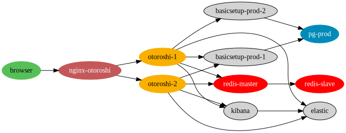

# Basic Otoroshi powered infrastructure

this docker-compose file simulates a basic otoroshi powered infrastructure.



## Build and run

```sh
docker-compose build
docker-compose up
```

## Test api

You can try the app apis with curl

```sh
curl http://api-tenant1.oto.tools:8889/ -u basicsetup-prod-tenant1-apikey:basicsetup-prod-tenant1-apikey | jqn
```

## Test otoroshi

To try otoroshi, just go to http://otoroshi.oto.tools:8889, login with admin@otoroshi.io/password

You can also try to access basic-setup lines from your browser, just go to 

* http://tenant1.oto.tools:8889

You can also access Otoroshi events in kibana at http://kibana.oto.tools:8889

You can also access Elastic data 

```sh
curl -X GET http://elastic.oto.tools:8889/analytics*/analytics/_search?q=@type:GatewayEvent&q=status:200 -u basicsetup-es-apikey:basicsetup-es-apikey | jqn
```

## Restart a service

```sh
docker-compose restart basicsetup-prod-instance-1
```

## Shutdown everything

```sh
docker-compose down
```
