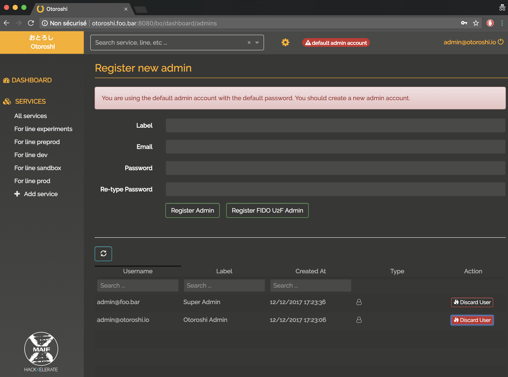

# Manage admin users

## Create admin user after the first run

click on the `Create an admin user` warning popup, or go to `settings (cog icon) / Admins`

@@@ div { .centered-img }

@@@

and you will see the list of registered admin users

@@@ div { .centered-img }

@@@

now, enter informations about the new admin you want to create 

@@@ div { .centered-img }

@@@

and click on `Register Admin`.

@@@ div { .centered-img }

@@@

now you can discard the generated admin, confirm, then logout, login with the new admin user and the danger popup will go away

## Create admin user with U2F device login

go to `settings (cog icon) / Admins`

@@@ div { .centered-img }

@@@

now, enter informations about the new admin you want to create 

@@@ div { .centered-img }

@@@

and click on `Register FIDO U2F Admin`.

Otoroshi will then ask you to plug your FIDO U2F device and touch it to finish registration

@@@ div { .centered-img }

@@@

@@@ warning
To be able to use FIDO U2F devices, Otoroshi must be served over https
@@@

## Discard admin user

go to `settings (cog icon) / Admins`, at the bottom of the page, you will see a list of admin users that you can discard. Just click on the `Discard User` button on the right side of the row and confirm that you actually want to discard an admin user.

@@@ div { .centered-img }

@@@

## Admin sessions management

Go to `settings (cog icon) / Admins sessions`, you will see a list of active admin user sessions

@@@ div { .centered-img }

@@@

you can either discard sessions one by one using the `Discard Session` on each row of the list or discard all active sessions using the `Discard all sessions` button at the top of the page.

