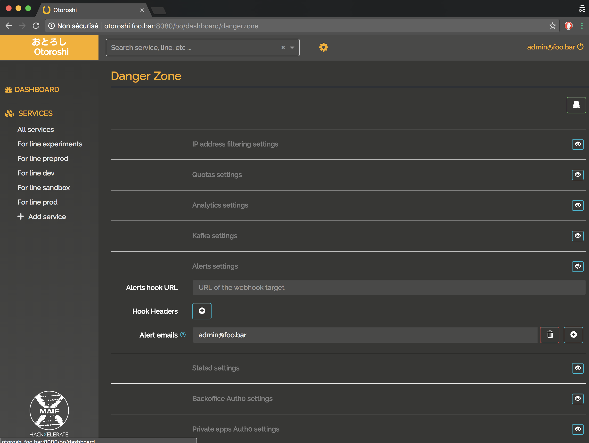
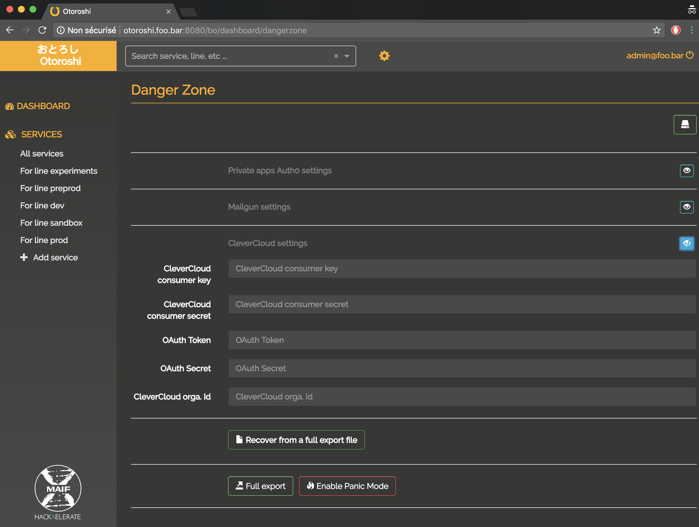
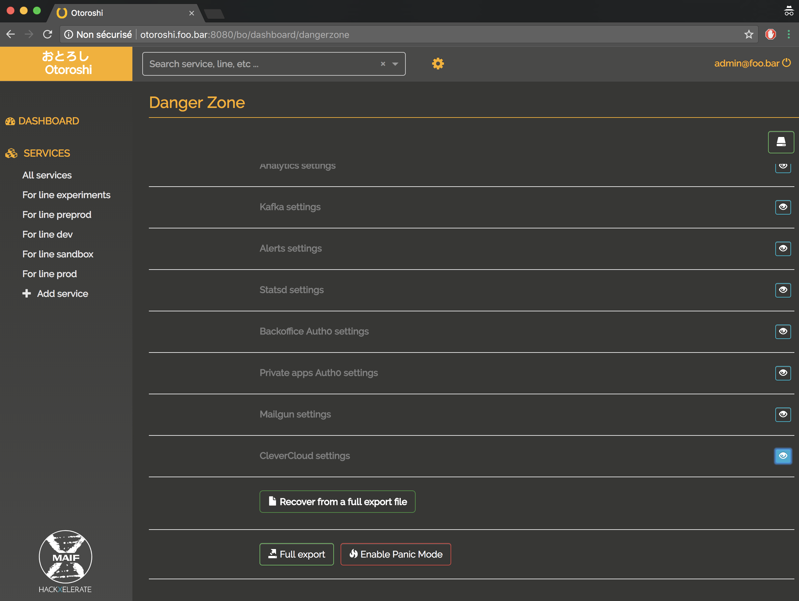

# Configure the Danger zone 

now that you have an actual admin account, got to `setting (cog icon) / Danger Zone` in order to configure your Otoroshi instance.

@@@ div { .centered-img }

@@@

## Commons settings

@@@ div { .centered-img }

@@@

## Whitelist / blacklist settings

@@@ div { .centered-img }

@@@

## Global throttling settings

@@@ div { .centered-img }

@@@

## Analytics settings

@@@ div { .centered-img }

@@@

## Kafka settings

@@@ div { .centered-img }

@@@

## Alerts settings

@@@ div { .centered-img }

@@@

## StatsD settings

@@@ div { .centered-img }

@@@

## Auth0 settings 

@@@ div { .centered-img }

@@@

## Mailgun settings

@@@ div { .centered-img }

@@@

## CleverCloud settings

@@@ div { .centered-img }

@@@

## Import / exports and panic mode

@@@ div { .centered-img }

@@@
