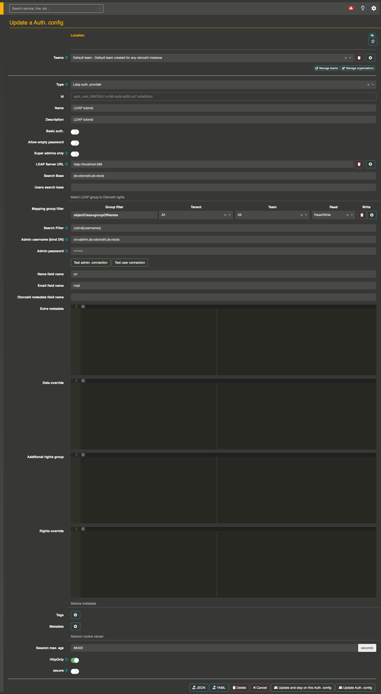
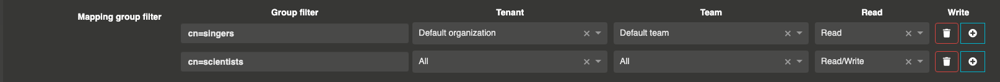

# Secure an app and/or your Otoroshi UI with LDAP

### Before you start

@@include[fetch-and-start.md](../includes/fetch-and-start.md) { #init }

#### Running an simple OpenLDAP server 

Run OpenLDAP docker image : 
```sh
docker run \
  -p 389:389 \
  -p 636:636  \
  --env LDAP_ORGANISATION="Otoroshi company" \
  --env LDAP_DOMAIN="otoroshi.tools" \
  --env LDAP_ADMIN_PASSWORD="otoroshi" \
  --env LDAP_READONLY_USER="false" \
  --env LDAP_TLS"false" \
  --env LDAP_TLS_ENFORCE"false" \
  --name my-openldap-container \
  --detach osixia/openldap:1.5.0
```

Let's make the first search in our LDAP container :

```sh
docker exec my-openldap-container ldapsearch -x -H ldap://localhost -b dc=otoroshi,dc=tools -D "cn=admin,dc=otoroshi,dc=tools" -w otoroshi
```

This should output :
```sh
# extended LDIF
 ...
# otoroshi.tools
dn: dc=otoroshi,dc=tools
objectClass: top
objectClass: dcObject
objectClass: organization
o: Otoroshi company
dc: otoroshi

# search result
search: 2
result: 0 Success
...
```

Now you can seed the open LDAP server with a few users. 

Join your LDAP container.

```sh
docker exec -it my-openldap-container "/bin/bash"
```

The command `ldapadd` needs of a file to run.

Launch this command to create a `bootstrap.ldif` with one organization, one singers group with Johnny user and a last group with Einstein as scientist.

```sh
echo -e "
dn: ou=People,dc=otoroshi,dc=tools
objectclass: top
objectclass: organizationalUnit
ou: People

dn: ou=Role,dc=otoroshi,dc=tools
objectclass: top
objectclass: organizationalUnit
ou: Role

dn: uid=johnny,ou=People,dc=otoroshi,dc=tools
objectclass: top
objectclass: person
objectclass: organizationalPerson
objectclass: inetOrgPerson
uid: johnny
cn: Johnny
sn: Brown
mail: johnny@otoroshi.tools
postalCode: 88442
userPassword: password

dn: uid=einstein,ou=People,dc=otoroshi,dc=tools
objectclass: top
objectclass: person
objectclass: organizationalPerson
objectclass: inetOrgPerson
uid: einstein
cn: Einstein
sn: Wilson
mail: einstein@otoroshi.tools
postalCode: 88443
userPassword: password

dn: cn=singers,ou=Role,dc=otoroshi,dc=tools
objectclass: top
objectclass: groupOfNames
cn: singers
member: uid=johnny,ou=People,dc=otoroshi,dc=tools

dn: cn=scientists,ou=Role,dc=otoroshi,dc=tools
objectclass: top
objectclass: groupOfNames
cn: scientists
member: uid=einstein,ou=People,dc=otoroshi,dc=tools
" > bootstrap.ldif

ldapadd -x -w otoroshi -D "cn=admin,dc=otoroshi,dc=tools" -f bootstrap.ldif -v
```

### Create an Authentication configuration

- Go ahead, and navigate to @link:[http://otoroshi.oto.tools:8080](http://otoroshi.oto.tools:8080) { open=new }
- Click on the cog icon on the top right
- Then `Authentication configs` button
- And add a new configuration when clicking on the `Add item` button
- Select the `Ldap auth. provider` in the type selector field
- Set a basic name and description
- Then set `ldap://localhost:389` as `LDAP Server URL`and `dc=otoroshi,dc=tools` as `Search Base`
- Create a group filter (in the next part, we'll change this filter to spread users in different groups with given rights) with 
    - objectClass=groupOfNames as `Group filter` 
    - All as `Tenant`
    - All as `Team`
    - Read/Write as `Rights`
- Set the search filter as `(uid=${username})`
- Set `cn=admin,dc=otoroshi,dc=tools` as `Admin username`
- Set `otoroshi` as `Admin password`
- At the bottom of the page, disable the `secure` button (because we're using http and this configuration avoid to include cookie in an HTTP Request without secure channel, typically HTTPs)


 At this point, your configuration should be similar to :
 
<!-- oto-scenario
 - goto /bo/dashboard/auth-configs/edit/auth_mod_09975547-a186-4a2d-a550-ca71a0a03c0c
 - wait 1000
 - screenshot-area generated-hows-to-ldap-auth-configs.png #app>div>div.container-fluid>div>div.col-sm-10.col-sm-offset-2.main
-->


> Dont' forget to save on the bottom page your configuration before to quit the page.

- Test the connection when clicking on `Test admin connection` button. This should display a `It works!` message

- Finally, test the user connection button and set `johnny/password` or `einstein/password` as credentials. This should display a `It works!` message

> Dont' forget to save on the bottom page your configuration before to quit the page.


### Connect to Otoroshi with LDAP authentication

To secure Otoroshi with your LDAP configuration, we have to register an **Authentication configuration** as a BackOffice Auth. configuration.

- Navigate to the **danger zone** (when clicking on the cog on the top right and selecting Danger zone)
- Scroll to the **BackOffice auth. settings**
- Select your last Authentication configuration (created in the previous section)
- Save the global configuration with the button on the top right

### Testing your configuration

- Disconnect from your instance
- Then click on the **Login using third-party** button (or navigate to @link:[http://otoroshi.oto.tools:8080/backoffice/auth0/login](http://otoroshi.oto.tools:8080/backoffice/auth0/login) { open=new })
- Set `johnny/password` or `einstein/password` as credentials

> A fallback solution is always available in the event of a bad authentication configuration. By going to http://otoroshi.oto.tools:8080/bo/simple/login, the administrators will be able to redefine the configuration.


#### Secure an app with LDAP authentication

Once the configuration is done, you can secure any of Otoroshi services. 

- Navigate to any created service
- Jump to the `URL Patterns` section
- Enable your service as `Public UI`
- Then scroll to `Authentication` section
- Enable `Enforce user authentication`
- Select your Authentication config inside the list
- Enable `Strict mode`
- Don't forget to save your configuration

<!-- oto-scenario
 - goto /bo/dashboard/lines/prod/services/service_mirror_otoroshi_fr
 - wait 2000
 - click div[data-screenshot="ldap-tutorial-authentication"]>div:nth-child(2)>div
 - screenshot-area generated-hows-to-secure-an-app-with-ldap.png div[data-screenshot="ldap-tutorial-authentication"]
-->


Now you can try to call your defined service and see the login module appears.

#### Manage LDAP users rights on Otoroshi

For each LDAP groups, you can affect a list of rights : 

- on an `Organization` : only resources of an organization
- on a `Team` : only resources belonging to this team
- and a level of rights : `Read`, `Write` or `Read/Write`


Start by navigate to your authentication configuration (created in @ref:[previous](#create-an-authentication-configuration) step).

Then, replace the values of the `Mapping group filter` field to match LDAP groups with Otoroshi rights.

<!-- oto-scenario
 - goto /bo/dashboard/auth-configs/edit/auth_mod_91bb8b38-620e-4c18-9bbc-7c8d1efd63cc
 - wait 1000
 - screenshot-area generated-hows-to-ldap-manage-users.png #app>div>div.container-fluid>div>div.col-sm-10.col-sm-offset-2.main>div>div> div.row>div>div>div>form>div>div:nth-child(3)>div:nth-child(11)
-->


With this configuration, Einstein is an administrator of Otoroshi with full rights (read / write) on all organizations.

Conversely, Johnny can't see any configuration pages (like the danger zone) because he has only the read rights on Otoroshi.

You can easily test this behaviour by @ref:[testing](#testing-your-configuration) with both credentials.


#### Advanced usage of LDAP Authentication

In the previous section, we have define rights for each LDAP groups. But in some case, we want to have a finer granularity like set rights for a specific user. The last 4 fields of the authentication form cover this. 

Let's start by adding few properties for each connected users with `Extra metadata`.

```json
// Add this configuration in extra metadata part
{
  "provider": "OpenLDAP"
}
```

The next field `Data override` is merged with extra metadata when a user connects to a `private app` or to the UI (inside Otoroshi, private app is a service secure by any authentication module). The `Email field name` is configured to match with the `mail` field from LDAP user data.

```json 
{
  "johnny@otoroshi.tools": {
    "stage_name": "Jean-Philippe Smet"
  }
}
```

If you try to connect to an app with this configuration, the user result profile should be :

```json
{
  ...,
  "metadata": {
    "lastname": "Hallyday",
    "stage_name": "Jean-Philippe Smet"
  }
}
```

Let's try to increase the Johnny rights with the `Additional rights group`.

This field supports the creation of virtual groups. A virtual group is composed of a list of users and a list of rights for each teams/organizations.

```json
// increase_johnny_rights is a virtual group which adds full access rights at johnny 
{
  "increase_johnny_rights": {
    "rights": [
      {
        "tenant": "*:rw",
        "teams": [
          "*:rw"
        ]
      }
    ],
    "users": [
      "johnny@otoroshi.tools"
    ]
  }
}
```

The last field `Rights override` is useful when you want erase the rights of an user with only specific rights. This field is the last to be applied on the user rights. 

To resume, when Johnny connects to Otoroshi, he receives the rights to only read  the default Organization (from **Mapping group filter**), then he is promote to administrator role (from **Additional rights group**) and finally his rights are reset with the last field **Rights override** to the read rights.

```json 
{
  "johnny@otoroshi.tools": [
    {
      "tenant": "*:r",
      "teams": [
        "*:r"
      ]
    }
  ]
}
```


