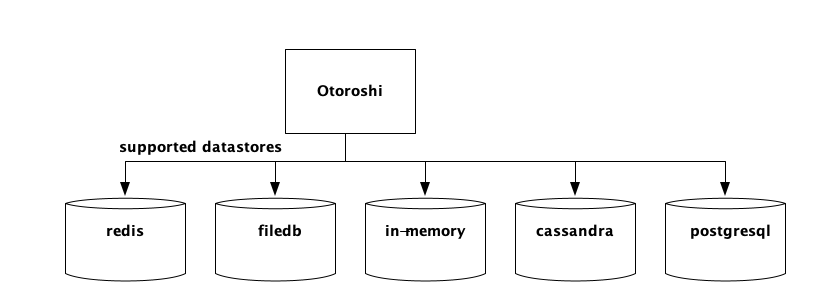

# Setup Otoroshi

Right now, Otoroshi supports multiple datastore. You can choose one datastore over another depending on your use case.

@@@div { .plugin .platform } 
<div style="font-size: 22px; font-weight: bold;">Redis</div>

<div class="element-tag recommended-tag">Recommended</div>

The **redis** datastore is quite nice when you want to easily deploy several Otoroshi instances.


@link:[Documentation](https://redis.io/topics/quickstart)
@@@

@@@div { .plugin .platform } 
<div style="font-size: 22px; font-weight: bold;">In memory</div>

The **in-memory** datastore is kind of interesting. It can be used for testing purposes, but it is also a good candidate for production because of its fastness.


@ref:[Start with](../getting-started.md)
@@@

@@@div { .plugin .platform } 
<div style="font-size: 22px; font-weight: bold;">Cassandra</div>

<div class="element-tag cluster-tag">Clustering usage</div>

Experimental support, should be used in cluster mode for leaders


@link:[Documentation](https://cassandra.apache.org/doc/latest/cassandra/getting_started/installing.html)
@@@

@@@div { .plugin .platform } 
<div style="font-size: 22px; font-weight: bold;">Postgresql</div>

Or any postgresql compatible databse like cockroachdb for instance (experimental support, should be used in cluster mode for leaders)


@link:[Documentation](https://www.postgresql.org/docs/10/tutorial-install.html)
@@@

@@@div { .plugin .platform } 

<div style="font-size: 22px; font-weight: bold;">FileDB</div>

The **filedb** datastore is pretty handy for testing purposes, but is not supposed to be used in production mode. 
Not suitable for production usage.


@@@


@@@ div { .centered-img }

@@@

## Setup your configuration file

There is a lot of things you can configure in Otoroshi. By default, Otoroshi provides a configuration that should be enough for testing purpose. But you'll likely need to update this configuration when you'll need to move into production.

In this page, any configuration property can be set at runtime using a `-D` flag when launching Otoroshi like

```sh
java -Dhttp.port=8080 -jar otoroshi.jar
```

or

```sh
./bin/otoroshi -Dhttp.port=8080 
```

if you want to define your own config file and use it on an otoroshi instance, use the following flag

```sh
java -Dconfig.file=/path/to/otoroshi.conf -jar otoroshi.jar
``` 

### Example of a custom. configuration file

```conf
include "application.conf"

http.port = 8080

app {
  storage = "inmemory"
  importFrom = "./my-state.json"
  env = "prod"
  domain = "oto.tools"
  rootScheme = "http"
  snowflake {
    seed = 0
  }
  events {
    maxSize = 1000
  }
  backoffice {
    subdomain = "otoroshi"
    session {
      exp = 86400000
    }
  }
  privateapps {
    subdomain = "privateapps"
    session {
      exp = 86400000
    }
  }
  adminapi {
    targetSubdomain = "otoroshi-admin-internal-api"
    exposedSubdomain = "otoroshi-api"
    defaultValues {
      backOfficeGroupId = "admin-api-group"
      backOfficeApiKeyClientId = "admin-api-apikey-id"
      backOfficeApiKeyClientSecret = "admin-api-apikey-secret"
      backOfficeServiceId = "admin-api-service"
    }
  }
  claim {
    sharedKey = "mysecret"
  }
  filedb {
    path = "./filedb/state.ndjson"
  }
}

play.http {
  session {
    secure = false
    httpOnly = true
    maxAge = 2592000000
    domain = ".oto.tools"
    cookieName = "oto-sess"
  }
}
```

### Reference configuration

@@snip [reference.conf](../snippets/reference.conf) 

### More config. options

See default configuration at

* @link:[Base configuration](https://github.com/MAIF/otoroshi/blob/master/otoroshi/conf/base.conf) { open=new }
* @link:[Application configuration](https://github.com/MAIF/otoroshi/blob/master/otoroshi/conf/application.conf) { open=new }

## Configuration with env. variables

Eevery property in the configuration file can be overriden by an environment variable if it has env variable override written like `${?ENV_VARIABLE}`).

## Reference configuration for env. variables

@@snip [reference-env.conf](../snippets/reference-env.conf) 

## Setup your hosts

By default, Otoroshi starts with domain `oto.tools` that automatically targets `127.0.0.1` with no changes to you `/etc/hosts` file. Of course you can change the domain, you have to add the values in your `/etc/hosts` file according to the setting you put in Otoroshi configuration

* `app.domain` => `mydomain.org`
* `app.backoffice.subdomain` => `otoroshi`
* `app.privateapps.subdomain` => `privateapps`
* `app.adminapi.exposedSubdomain` => `otoroshi-api`
* `app.adminapi.targetSubdomain` => `otoroshi-admin-internal-api`

for instance if you want to change the default domain and use something like `otoroshi.mydomain.org`, then start otoroshi like 

```sh
java -Dapp.domain=mydomain.org -jar otoroshi.jar
```

@@@ warning
Otoroshi cannot be accessed using `http://127.0.0.1:8080` or `http://localhost:8080` because Otoroshi uses Otoroshi to serve it's own UI and API. When otoroshi starts with an empty database, it will create a service descriptor for that using `app.domain` and the settings listed on this page and in the here that serve Otoroshi API and UI on `http://otoroshi-api.${app.domain}` and `http://otoroshi.${app.domain}`.
Once the descriptor is saved in database, if you want to change `app.domain`, you'll have to edit the descriptor in the database or restart Otoroshi with an empty database.
@@@
