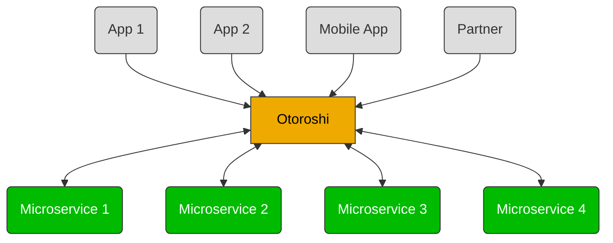
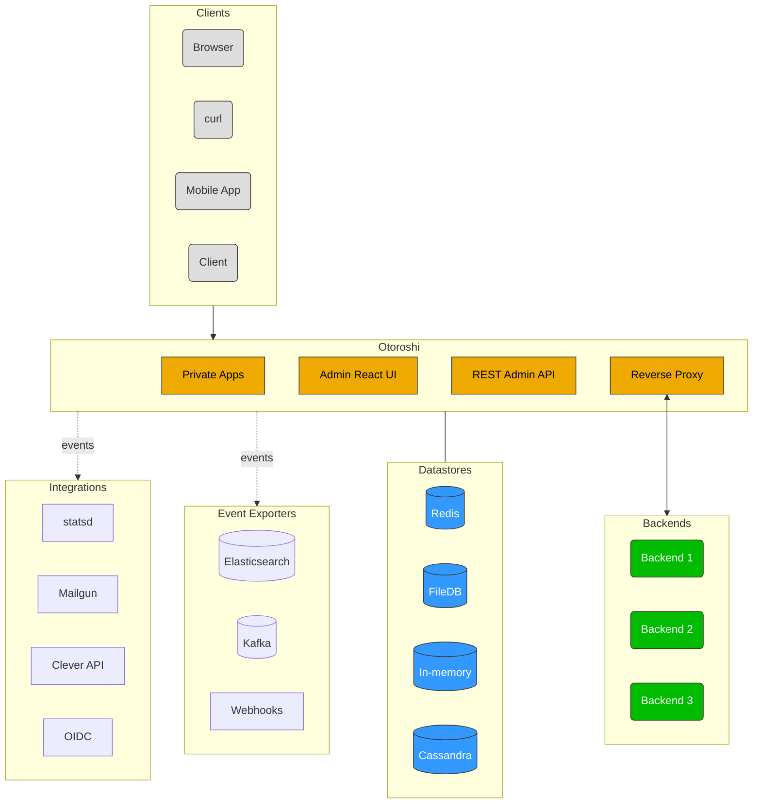

# Architecture

When we started the development of Otoroshi, we had several classical patterns in mind like `Service gateway`, `Service locator`, `Circuit breakers`, etc ...

At start we thought about providing a bunch of librairies that would be included in each microservice or app to perform these tasks. But the more we were thinking about it, the more it was feeling weird, unagile, etc, it also prevented us to use any technical stack we wanted to use. So we decided to change our approach to something more universal.

We chose to make Otoroshi the central part of our microservices system, something between a reverse-proxy, a service gateway and a service locator where each call to a microservice (even from another microservice) must pass through Otoroshi. There are multiple benefits to do that, each call can be logged, audited, monitored, integrated with a circuit breaker, etc without imposing libraries and technical stack. Any service is exposed through its own domain and we rely only on DNS to handle the service location part. Any access to a service is secured by default with an api key and is supervised by a circuit breaker to avoid cascading failures.

Otoroshi tries to embrace our [global philosophy](./about.md#philosophy) by providing a full featured REST admin api, a gorgeous admin dashboard written in [React](https://reactjs.org) that uses the api, by generating traffic events, alerts events, audit events that can be consumed by several channels. Otoroshi also supports a bunch of datastores to better match with different use cases.

