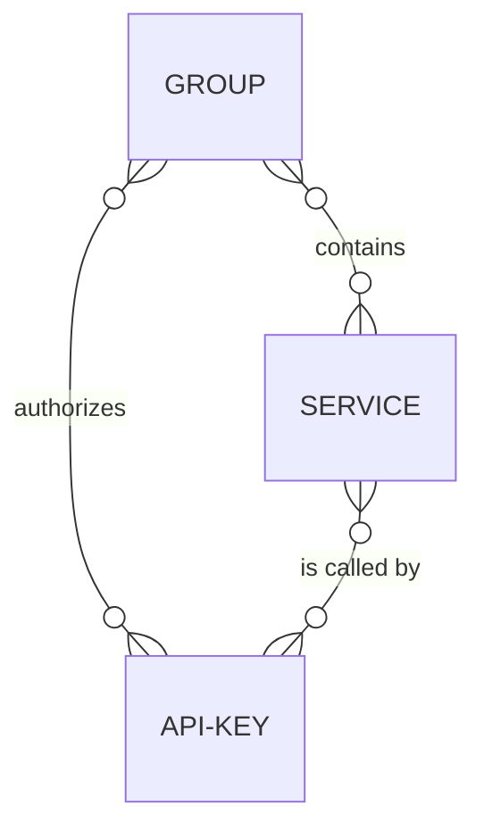

# API Keys

An API key is a credential pair (`clientId` + `clientSecret`) that **authenticates and authorizes** machine-to-machine or developer calls to your routes and APIs. 
It is the simplest way to protect an endpoint in Otoroshi: create a key, bind it to one or more routes, 
and every request must prove it holds the key before being forwarded to the backend.

## Why use API keys

API keys solve a common problem: you need to know **who** is calling your API, **control how much** they can call it, 
and **revoke access** instantly when needed, all without requiring an external identity provider or a full OAuth2 flow. They are ideal for:

- **Service-to-service communication** within a trusted network, where a lightweight shared secret is sufficient.
- **Developer access** to public or partner APIs, where each consumer receives their own key with individual quotas.
- **Quick prototyping**, where you need authentication up and running in minutes rather than configuring a full identity stack.

For user-facing authentication (login flows, SSO, session management), consider [authentication modules](./auth-modules) instead. For fine-grained token validation without a shared secret, look at [JWT verifiers](./jwt-verifiers.md). API keys and these other mechanisms are complementary and can be combined on the same route through the plugin chain.

## How API keys work in Otoroshi

Each API key consists of two values:

- **`clientId`** -- a unique public identifier (16 random characters by default).
- **`clientSecret`** -- a private secret (64 random characters by default) that proves ownership of the key.

The client includes these credentials in every request. Otoroshi supports several extraction methods so you can pick the one that fits your stack:

| Method | How it works |
|--------|-------------|
| **Custom headers** | Send `Otoroshi-Client-Id` and `Otoroshi-Client-Secret` headers (header names are configurable) |
| **Basic authentication** | Send an `Authorization: Basic <base64(clientId:clientSecret)>` header |
| **Bearer token** | Otoroshi-specific bearer token format (`otoapk_<clientId>_<secret_hash>`) |
| **JWT token** | Embed the `clientId` and `clientSecret` inside a signed JWT sent as a bearer |
| **Client ID only** | When `allowClientIdOnly` is enabled, the client ID alone (in a header, query param, or cookie) is enough |

Once extracted, Otoroshi verifies the credentials, checks that the key is enabled and not expired, confirms it is authorized on the target route or group, enforces quotas and restrictions, and only then forwards the request to the backend.

## Key features at a glance

- **Quotas** -- throttling (calls per second), daily, and monthly call limits, all tracked automatically and enforceable per key.
- **Automatic secret rotation** -- the secret can rotate on a configurable schedule with a grace period during which both old and new secrets are accepted, enabling zero-downtime credential updates.
- **Restrictions** -- fine-grained allow/deny rules based on HTTP method and path, so a single key can be scoped to specific operations.
- **Expiration** -- a `validUntil` timestamp that automatically disables the key after a given date, useful for time-limited access.
- **Read-only mode** -- restricts the key to `GET`, `HEAD`, and `OPTIONS` methods only.
- **Tags and metadata** -- arbitrary labels and key-value pairs used for routing constraints, filtering, and organizational purposes.
- **Authorization scope** -- each key declares which routes, service groups, and APIs it is authorized on, so a single key can cover multiple endpoints or be tightly scoped to just one.

## How API keys relate to other entities

- **[Routes](./routes.md)** and **[APIs](./apis.mdx)** -- an API key is bound to specific routes or APIs through its `authorizedEntities` list. A route can require API key authentication via the `ApikeyCalls` plugin in its plugin chain.
- **[Service Groups](./service-groups.mdx)** -- keys can be authorized on an entire group, automatically granting access to every route in that group.
- **[JWT Verifiers](./jwt-verifiers.md)** -- API keys can coexist with JWT verifiers on the same route. One of the extraction methods even allows embedding the API key credentials inside a signed JWT.
- **[Authentication Modules](./auth-modules)** -- while API keys handle programmatic/machine access, authentication modules handle user login flows. Both can be active on different routes or even on the same route for different use cases.



You can find a practical example [here](../tutorials/secure-with-apikey.mdx).

## UI page

You can find all API keys [here](http://otoroshi.oto.tools:8080/bo/dashboard/apikeys)

## Properties

| Property | Type | Default | Description |
|----------|------|---------|-------------|
| `clientId` | string |     | Unique random identifier for this API key |
| `clientSecret` | string |     | Random secret used to validate the API key |
| `clientName` | string |     | Display name of the API key (used for debugging) |
| `description` | string | `""` | Description of the API key |
| `authorizedEntities` | array of string |     | Groups, routes, services, and APIs this key is authorized on |
| `enabled` | boolean | `true` | Whether the API key is active. Disabled keys reject all calls |
| `readOnly` | boolean | `false` | If enabled, only `GET`, `HEAD`, and `OPTIONS` methods are allowed |
| `allowClientIdOnly` | boolean | `false` | Allow clients to authenticate with only the client ID (in a specific header), without the secret |
| `constrainedServicesOnly` | boolean | `false` | This API key can only be used on services with API key routing constraints |
| `validUntil` | number | `null` | Auto-disable the API key after this timestamp (milliseconds). Once expired, the key is disabled |
| `tags` | array of string | `[]` | Tags for categorization |
| `metadata` | object | `{}` | Key/value metadata |

## Quotas

Quotas control the rate of API calls allowed for this key.

| Property | Type | Default | Description |
|----------|------|---------|-------------|
| `throttlingQuota` | number | unlimited | Maximum number of calls per second |
| `dailyQuota` | number | unlimited | Maximum number of calls per day |
| `monthlyQuota` | number | unlimited | Maximum number of calls per month |

:::warning
Daily and monthly quotas are computed as follows:

* **Daily quota**: between 00:00:00.000 and 23:59:59.999 of the current day
* **Monthly quota**: between the first day at 00:00:00.000 and the last day at 23:59:59.999 of the current month
:::
### Quota consumption

The current consumption can be checked on the API key detail page or via the admin API:

| Property | Description |
|----------|-------------|
| `currentCallsPerDay` | Number of calls consumed today |
| `remainingCallsPerDay` | Remaining calls for today |
| `currentCallsPerMonth` | Number of calls consumed this month |
| `remainingCallsPerMonth` | Remaining calls for this month |

## Automatic secret rotation

API keys can handle automatic secret rotation. When enabled, the secret is changed periodically. During the grace period, both the old and new secrets are valid.

| Property | Type | Default | Description |
|----------|------|---------|-------------|
| `enabled` | boolean | `false` | Enable automatic rotation |
| `rotationEvery` | number | `744` | Rotate the secret every N hours |
| `gracePeriod` | number | `168` | Period (hours) during which both old and new secrets are accepted |

## Restrictions

Restrictions allow fine-grained access control based on request path and method.

| Property | Type | Default | Description |
|----------|------|---------|-------------|
| `enabled` | boolean | `false` | Enable restrictions |
| `allowLast` | boolean | `false` | Test forbidden and not-found paths before allowed paths |
| `allowed` | array of object | `[]` | Allowed paths (method + path pairs) |
| `forbidden` | array of object | `[]` | Forbidden paths |
| `notFound` | array of object | `[]` | Paths that return 404 |

## Call examples

Once an API key is created, you can call protected routes using one of these methods:

### Using headers

```bash
curl -H "Otoroshi-Client-Id: <clientId>" \
     -H "Otoroshi-Client-Secret: <clientSecret>" \
     https://api.oto.tools/users
```

### Using Basic authentication

```bash
curl -H "Authorization: Basic <base64(clientId:clientSecret)>" \
     https://api.oto.tools/users
```

### Using client ID only (if `allowClientIdOnly` is enabled)

```bash
curl -H "Otoroshi-Client-Id: <clientId>" \
     https://api.oto.tools/users
```

## JSON example

```json
{
  "clientId": "abcdef123456",
  "clientSecret": "secret_xyz789",
  "clientName": "My API Key",
  "description": "Key for the payment service",
  "authorizedEntities": ["group_payment_apis", "route_checkout"],
  "enabled": true,
  "readOnly": false,
  "allowClientIdOnly": false,
  "constrainedServicesOnly": false,
  "validUntil": null,
  "throttlingQuota": 100,
  "dailyQuota": 10000,
  "monthlyQuota": 300000,
  "restrictions": {
    "enabled": false,
    "allowLast": false,
    "allowed": [],
    "forbidden": [],
    "notFound": []
  },
  "rotation": {
    "enabled": false,
    "rotationEvery": 744,
    "gracePeriod": 168
  },
  "tags": ["payment"],
  "metadata": {
    "team": "billing"
  }
}
```

## Admin API

```
GET    /api/apikeys           # List all API keys
POST   /api/apikeys           # Create an API key
GET    /api/apikeys/:id       # Get an API key by clientId
PUT    /api/apikeys/:id       # Update an API key
DELETE /api/apikeys/:id       # Delete an API key
PATCH  /api/apikeys/:id       # Partially update an API key
```

Additional endpoints:

```
GET /api/apikeys/:id/quotas   # Get current quota consumption
PUT /api/apikeys/:id/quotas   # Reset quotas
GET /api/groups/:groupId/apikeys  # List API keys for a group
```

## Related entities

* [Service Groups](./service-groups.mdx) - Groups that API keys can be authorized on
* [Routes](./routes.md) - Routes that API keys can be authorized on
* [APIs](./apis.mdx) - APIs where API keys are generated via subscriptions
