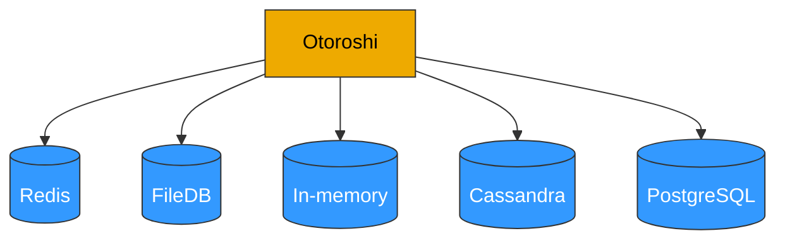

import { Image } from '@site/src/components/Image';

# Setup Otoroshi

in this section we are going to configure otoroshi before running it for the first time

## Setup the database

Right now, Otoroshi supports multiple datastore. You can choose one datastore over another depending on your use case.


<div className="provider-grid">
<div className="provider-card">
  <div className="provider-card-header">
    <h4>Redis</h4>
    <span className="provider-card-tag recommended">Recommended</span>
  </div>
  <p>The <strong>redis</strong> datastore is quite nice when you want to easily deploy several Otoroshi instances.</p>
  <div className="provider-card-img"><Image src="/img/docs/redis.png" alt="Redis" /></div>
  <div className="provider-card-action"><a href="https://redis.io/topics/quickstart">Documentation</a></div>
</div>
<div className="provider-card">
  <div className="provider-card-header">
    <h4>In memory</h4>
  </div>
  <p>The <strong>in-memory</strong> datastore is kind of interesting. It can be used for testing purposes, but it is also a good candidate for production because of its fastness.</p>
  <div className="provider-card-img"><Image src="/img/docs/inmemory.png" alt="In memory" /></div>
  <div className="provider-card-action"><a href="../getting-started">Start with</a></div>
</div>
<div className="provider-card">
  <div className="provider-card-header">
    <h4>Cassandra</h4>
    <span className="provider-card-tag clustering">Clustering</span>
  </div>
  <p>Experimental support, should be used in cluster mode for leaders</p>
  <div className="provider-card-img"><Image src="/img/docs/cassandra.png" alt="Cassandra" /></div>
  <div className="provider-card-action"><a href="https://cassandra.apache.org/doc/latest/cassandra/getting_started/installing.html">Documentation</a></div>
</div>
<div className="provider-card">
  <div className="provider-card-header">
    <h4>Postgresql</h4>
    <span className="provider-card-tag clustering">Clustering</span>
  </div>
  <p>Or any postgresql compatible database like cockroachdb for instance (experimental support, should be used in cluster mode for leaders)</p>
  <div className="provider-card-img"><Image src="/img/docs/postgres.png" alt="PostgreSQL" /></div>
  <div className="provider-card-action"><a href="https://www.postgresql.org/docs/10/tutorial-install.html">Documentation</a></div>
</div>
<div className="provider-card">
  <div className="provider-card-header">
    <h4>FileDB</h4>
  </div>
  <p>The <strong>filedb</strong> datastore is pretty handy for testing purposes, but is not supposed to be used in production mode. Not suitable for production usage.</p>
  <div className="provider-card-img"><Image src="/img/docs/filedb.png" alt="FileDB" /></div>
</div>
</div>



the first thing to setup is what kind of datastore you want to use with the `otoroshi.storage` setting

```conf
otoroshi {
  storage = "inmemory" # the storage used by otoroshi. possible values are lettuce (for redis), inmemory, file, http, s3, cassandra, postgresql             
  storage = ${?APP_STORAGE} # the storage used by otoroshi. possible values are lettuce (for redis), inmemory, file, http, s3, cassandra, postgresql  
  storage = ${?OTOROSHI_STORAGE} # the storage used by otoroshi. possible values are lettuce (for redis), inmemory, file, http, s3, cassandra, postgresql  
}
```

depending on the value you chose, you will be able to configure your datastore with the following configuration

import Tabs from '@theme/Tabs';
import TabItem from '@theme/TabItem';

<Tabs>
<TabItem value="inmemory" label="In memory" default>

```conf include=../snippets/datastores/inmemory.conf
```

</TabItem>
<TabItem value="redis" label="Redis">

```conf include=../snippets/datastores/lettuce.conf
```

</TabItem>
<TabItem value="postgresql" label="PostgreSQL">

```conf include=../snippets/datastores/pg.conf
```

</TabItem>
<TabItem value="cassandra" label="Cassandra">

```conf include=../snippets/datastores/cassandra.conf
```

</TabItem>
<TabItem value="file" label="File">

```conf include=../snippets/datastores/file.conf
```

</TabItem>
<TabItem value="http" label="HTTP">

```conf include=../snippets/datastores/http.conf
```

</TabItem>
<TabItem value="s3" label="S3">

```conf include=../snippets/datastores/s3.conf
```

</TabItem>
</Tabs>

## Setup your hosts before running

By default, Otoroshi starts with domain `oto.tools` that automatically targets `127.0.0.1` with no changes to your `/etc/hosts` file. Of course you can change the domain value, you have to add the values in your `/etc/hosts` file according to the setting you put in Otoroshi configuration or define the right ip address at the DNS provider level

* `otoroshi.domain` => `mydomain.org`
* `otoroshi.backoffice.subdomain` => `otoroshi`
* `otoroshi.privateapps.subdomain` => `privateapps`
* `otoroshi.adminapi.exposedSubdomain` => `otoroshi-api`
* `otoroshi.adminapi.targetSubdomain` => `otoroshi-admin-internal-api`

for instance if you want to change the default domain and use something like `otoroshi.mydomain.org`, then start otoroshi like 

```sh
java -Dotoroshi.domain=mydomain.org -jar otoroshi.jar
```

:::warning
Otoroshi cannot be accessed using `http://127.0.0.1:8080` or `http://localhost:8080` because Otoroshi uses Otoroshi to serve it's own UI and API. When otoroshi starts with an empty database, it will create a service descriptor for that using `otoroshi.domain` and the settings listed on this page and in the here that serve Otoroshi API and UI on `http://otoroshi-api.${otoroshi.domain}` and `http://otoroshi.${otoroshi.domain}`.
Once the descriptor is saved in database, if you want to change `otoroshi.domain`, you'll have to edit the descriptor in the database or restart Otoroshi with an empty database.
:::
:::warning
if your otoroshi instance runs behind a reverse proxy (L4 / L7) or inside a docker container where exposed ports (that you will use to access otoroshi) are not the same that the ones configured in otoroshi (`http.port` and `https.port`), you'll have to configure otoroshi exposed port to avoid bad redirection URLs when using authentication modules and other otoroshi tools. To do that, just set the values of the exposed ports in `otoroshi.exposed-ports.http = $theExposedHttpPort` (OTOROSHI_EXPOSED_PORTS_HTTP) and `otoroshi.exposed-ports.https = $theExposedHttpsPort` (OTOROSHI_EXPOSED_PORTS_HTTPS)
:::
## Setup your configuration file

There is a lot of things you can configure in Otoroshi. By default, Otoroshi provides a configuration that should be enough for testing purpose. But you'll likely need to update this configuration when you'll need to move into production.

In this page, any configuration property can be set at runtime using a `-D` flag when launching Otoroshi like 

```sh
java -Dhttp.port=8080 -jar otoroshi.jar
```

or

```sh
./bin/otoroshi -Dhttp.port=8080 
```

if you want to define your own config file and use it on an otoroshi instance, use the following flag

```sh
java -Dconfig.file=/path/to/otoroshi.conf -jar otoroshi.jar
``` 

### Example of a custom. configuration file

```conf
include "application.conf"

http.port = 8080

otoroshi {
  storage = "inmemory"
  importFrom = "./my-state.json"
  env = "prod"
  domain = "oto.tools"
  rootScheme = "http"
  snowflake {
    seed = 0
  }
  events {
    maxSize = 1000
  }
  backoffice {
    subdomain = "otoroshi"
    session {
      exp = 86400000
    }
  }
  privateapps {
    subdomain = "privateapps"
    session {
      exp = 86400000
    }
  }
  adminapi {
    targetSubdomain = "otoroshi-admin-internal-api"
    exposedSubdomain = "otoroshi-api"
    defaultValues {
      backOfficeGroupId = "admin-api-group"
      backOfficeApiKeyClientId = "admin-api-apikey-id"
      backOfficeApiKeyClientSecret = "admin-api-apikey-secret"
      backOfficeServiceId = "admin-api-service"
    }
  }
  claim {
    sharedKey = "mysecret"
  }
  filedb {
    path = "./filedb/state.ndjson"
  }
}

play.http {
  session {
    secure = false
    httpOnly = true
    maxAge = 2592000000
    domain = ".oto.tools"
    cookieName = "oto-sess"
  }
}
```

### Reference configuration

```conf include=../snippets/reference.conf
```

### More config. options

See default configuration at

* [Base configuration](https://github.com/MAIF/otoroshi/blob/master/otoroshi/conf/base.conf)
* [Application configuration](https://github.com/MAIF/otoroshi/blob/master/otoroshi/conf/application.conf)

## Configuration with env. variables

Eevery property in the configuration file can be overriden by an environment variable if it has env variable override written like `${?ENV_VARIABLE}`).

## Reference configuration for env. variables

```conf include=../snippets/reference-env.conf
```
