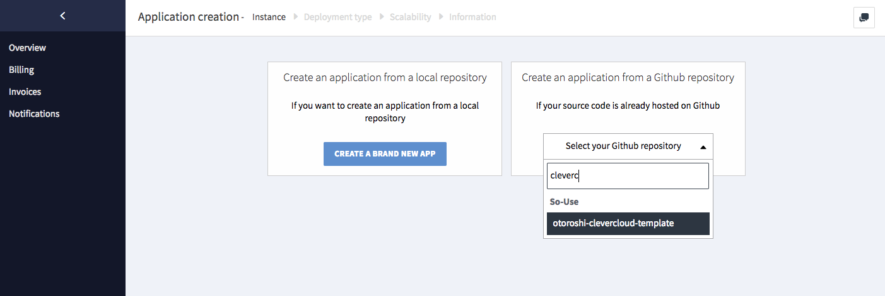
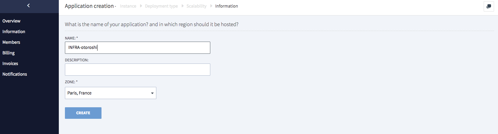

# CleverCloud

Now you want to use Otoroshi on CleverCloud. Otoroshi has been designed and create to run on CleverCloud and a lot of choices were made because of how CleverCloud works.

## Create an Otoroshi instance on CleverCloud

First, fork our project template on Github at https://github.com/MAIF/otoroshi-clevercloud-template.

If you want to customize the build script, edit `./clevercloud/build.sh`

If you want to customize the configuration file, edit `./clevercloud/prod.conf` or @ref:[use env. variables](../firstrun/env.md)

Create a new CleverCloud app based on your fork.

@@@ div { .centered-img }

@@@

Then choose what kind of app your want to create, for Otoroshi, choose `Java or Scala + Play 2`

@@@ div { .centered-img }

@@@

then you will be asked to choose what kind of machine you want to use. `M` instance is a good choice but you can use a less powerful machine. Also, you can activate auto-scaling or multi-instances to avoid high availibility issues.

@@@ div { .centered-img }

@@@

then choose a name for your app

@@@ div { .centered-img }

@@@

Now you just need to customize environnment variables and add the custom build script as pre deployment hook

`CC_PRE_BUILD_HOOK=./clevercloud/build.sh`

@@@ div { .centered-img }

@@@

or using expert mode

@@@ div { .centered-img }

@@@

now your app is ready, don't forget to add a custom domain name on clever app matching the Otoroshi app domain like

@@@ div { .centered-img }

@@@

## Use a pre-built version of Otoroshi

First, fork our project template on Github at https://github.com/MAIF/otoroshi-jar-clevercloud-template.

If you want to customize the build script, edit `./clevercloud/build.sh`

If you want to customize the configuration @ref:[use env. variables](../firstrun/env.md)

Create a new CleverCloud app based on your fork.

@@@ div { .centered-img }

@@@

Then choose what kind of app your want to create, for Otoroshi, choose `Java + Jar`

@@@ div { .centered-img }

@@@

then you will be asked to choose what kind of machine you want to use. Also, you can activate auto-scaling or multi-instances to avoid high availibility issues.

@@@ div { .centered-img }

@@@

then choose a name for your app

@@@ div { .centered-img }

@@@

Now you just need to customize environnment variables and add the custom build script as pre deployment hook

`CC_PRE_BUILD_HOOK=./clevercloud/build.sh`

@@@ div { .centered-img }

@@@

or using expert mode

@@@ div { .centered-img }

@@@

now your app is ready, don't forget to add a custom domain name on clever app matching the Otoroshi app domain like

@@@ div { .centered-img }

@@@

## Example of CleverCloud env. variables

you can add more env. variables to customize your Otoroshi instance like the following. Use the expert mode to copy/paste all the values in one shot

```
APP_ENV=prod
APP_STORAGE=redis
APP_DOMAIN=foo.bar
APP_ROOT_SCHEME=https
APP_BACKOFFICE_SUBDOMAIN=otoroshi
APP_PRIVATEAPPS_SUBDOMAIN=privateapps
ADMIN_API_TARGET_SUBDOMAIN=otoroshi-admin-internal-api
ADMIN_API_EXPOSED_SUBDOMAIN=otoroshi-api
ADMIN_API_GROUP=psIZ0hI6eAQ2vp7DQoFfdUSfdmamtlkbXwYCe9WQHGBZMO6o5Kn1r2VVSmI61IVX
ADMIN_API_CLIENT_ID=pWkwudAifrflg8Bh
ADMIN_API_CLIENT_SECRET=ip53UuY5BFiM3wXkVUhhYrVdbsDYsANCNdRMnW3pU4I268ylsF6xxkvusS6Wv4AW
ADMIN_API_SERVICE_ID=GVQUWMZHaEYr1tCTNe9CdXOVE4DQnu1VUAx7YyXDlo5XupY3laZlWUnGyDt1vfGx
ADMIN_API_LOCAL=false
CACHE_DEPENDENCIES=true
CC_PRE_BUILD_HOOK=./clevercloud/build.sh
CLAIM_SHAREDKEY=Tx1uQXW11pLNlZ25S4A08Uf8HbWDPxZ3KGSSm0B1s90gRk10PNy4d1HKY4Dnvvv5
ENABLE_METRICS=true
JAVA_VERSION=8
REDIS_HOST=xxx
REDIS_PORT=xxx
REDIS_PASSWORD=xxx
PORT=8080
PLAY_CRYPTO_SECRET=7rNFga4AComd6ey09W9PaHqllLmPHb8WHBhlRe9xjTHOPlN15BCeSQf610cmLU1w
SESSION_SECURE_ONLY=true
SESSION_MAX_AGE=259200000
SESSION_DOMAIN=.foo.bar
SESSION_NAME=otoroshi-session
NETTY_TRANSPORT=native
USER_AGENT=otoroshi
```