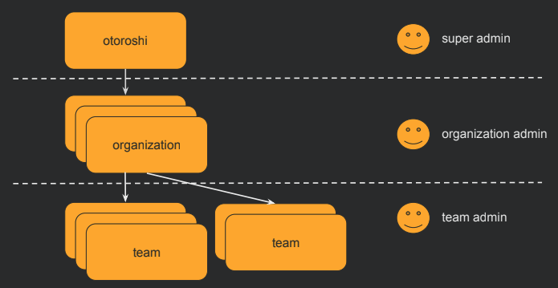

# Organizations

Organizations (also called tenants) are the highest level for grouping resources in Otoroshi. Every entity in Otoroshi belongs to an organization and one or more @ref:[teams](./teams.md).

## UI page

You can find all organizations [here](http://otoroshi.oto.tools:8080/bo/dashboard/organizations)

## Properties

| Property | Type | Description |
|----------|------|-------------|
| `id` | string | Unique identifier of the organization (also called `tenant`) |
| `name` | string | Display name of the organization |
| `description` | string | Description of the organization |
| `tags` | array of string | Tags for categorization |
| `metadata` | object | Key/value metadata |

## Use cases

Organizations let you separate resources by logical boundaries:

* **Business units**: Separate resources by services or departments in your enterprise
* **Internal vs. external**: Split internal services from partner-facing or public services
* **Environments**: Use different organizations for production, staging, and development (though this can also be handled at the infrastructure level)
* **Multi-tenancy**: Serve multiple independent customers from a single Otoroshi instance

@@@ div { .centered-img }

@@@

## Entities location

Every Otoroshi entity has a location property (`_loc` when serialized to JSON) that specifies which organization and teams can see and manage it.

An entity belonging to a specific organization:

```json
{
  "_loc": {
    "tenant": "organization-1",
    "teams": ["team-1", "team-2"]
  }
}
```

An entity visible to all organizations:

```json
{
  "_loc": {
    "tenant": "*",
    "teams": ["*"]
  }
}
```

## User access control

Admin users have rights scoped to organizations and teams. A user's `rights` field defines which organizations they can access and what level of access they have:

```json
{
  "rights": [
    {
      "tenant": "organization-1",
      "teams": [
        { "value": "team-1", "canRead": true, "canWrite": true },
        { "value": "team-2", "canRead": true, "canWrite": false }
      ]
    }
  ]
}
```

This allows fine-grained control: a user may have read/write access to one team's entities and read-only access to another's, all within the same organization.

## JSON example

```json
{
  "id": "organization_production",
  "name": "Production",
  "description": "Production environment organization",
  "metadata": {
    "env": "production"
  },
  "tags": ["production", "core"]
}
```

## Admin API

```
GET    /api/tenants           # List all organizations
POST   /api/tenants           # Create an organization
GET    /api/tenants/:id       # Get an organization
PUT    /api/tenants/:id       # Update an organization
DELETE /api/tenants/:id       # Delete an organization
PATCH  /api/tenants/:id       # Partially update an organization
```

> When an organization is deleted, the resources associated are not deleted. The organization reference on those resources will become invalid (empty).

## Related entities

* @ref:[Teams](./teams.md) - Teams exist within organizations and provide a second level of grouping
* @ref:[Otoroshi Admins](./otoroshi-admins.md) - Admin users have rights scoped to organizations and teams
