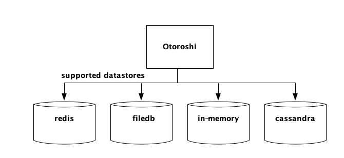

# Choose your datastore

Right now, Otoroshi supports multiple datastore.

You can choose one datastore over another depending on your use case.

Available datastores are the following :

* in memory
* redis
* cassandra (experimental support)
* mongodb (experimental support)
* levelDB (not suitable for production usage)

The **levelDB** datastore is pretty handy for testing purposes, but is not supposed to be used in production mode.

The **in-memory** datastore is kind of interesting... It can be used for testing purposes, but it is also a good candidate for production because of its fastness. But in that case, you need to provide a way to feed the deployed in-memory instances after the initial boot. In a future release (i.e. not yet :D), we will provide a master/workers slave based on Otoroshi in memory instances and kafka (see https://github.com/MAIF/otoroshi/issues/8 for more details about the feature).

The **redis** datastore is quite nice when you want to easily deploy several Otoroshi instances.

If you need a datastore more scalable than redis, then you can use the **cassandra** datastore or the **mongodb** datastore.

We plan to add more datastores support in the future :)

@@@ div { .centered-img }

@@@
