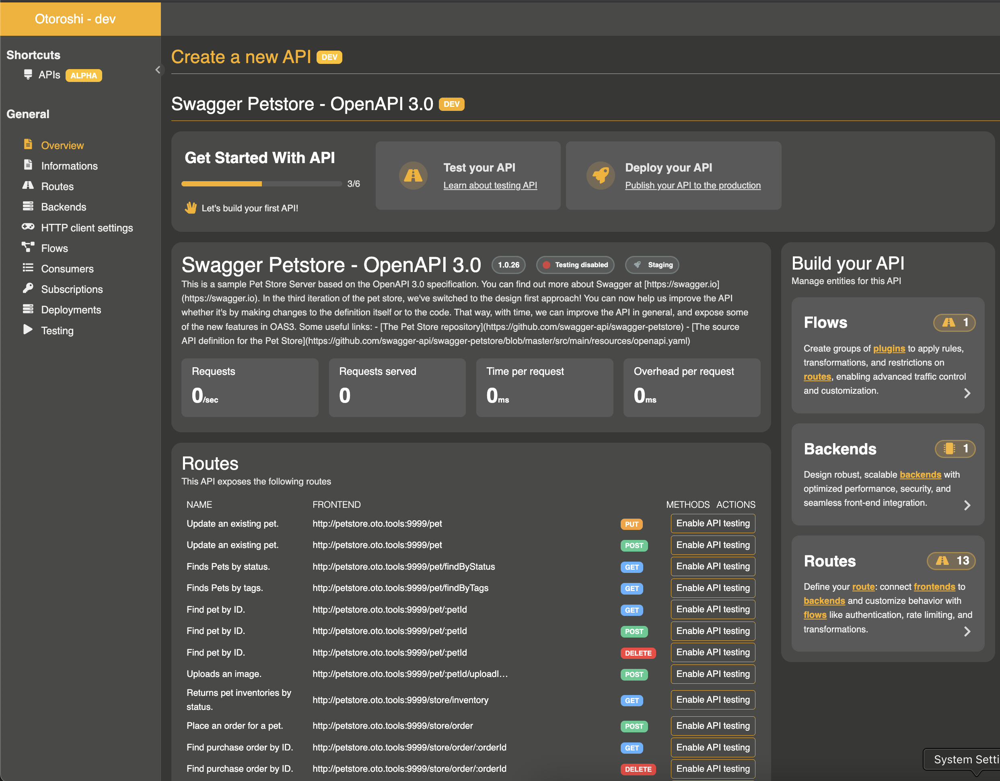

# Create your first API

The API let's you define reusable backends, declare multiple plugin flows that can be applied across different routes manage consumers and subscriptions, and track the state of an API throughout its lifecycle.

### Before you start

@@include[initialize.md](../includes/initialize.md) { #initialize-otoroshi }

### How to build an API with Otoroshi

To start this tutorial, we'll use Otoroshi's UI.

1. Go to [`/bo/dashboard/apis`](http://otoroshi.oto.tools:8080/bo/dashboard/apis) on your instance.  
2. Click the `Create new API` button.  
3. Select `Import OpenAPI`.  
4. The default parameters target the Petstore API.  
5. Create your API by clicking the `Create` button.  

You should see something like the following **Dashboard**:

@@@ div { .centered-img }

@@@

We have a new API, but for now, we can't call it yet. We need to enable **Testing** mode on the API first. Later, we'll deploy it to production.

But for now, let’s enable **Testing** mode.

To help you, there's a list of available tasks at the top of the dashboard. These tasks are simple and guide you toward a secure and well-understood production setup.

### Testing your API
<<<<<<< Updated upstream

Click the `Test your API` task on the top of the screen and enabled the mode by toggling the button.

Once done, copy
=======
>>>>>>> Stashed changes
