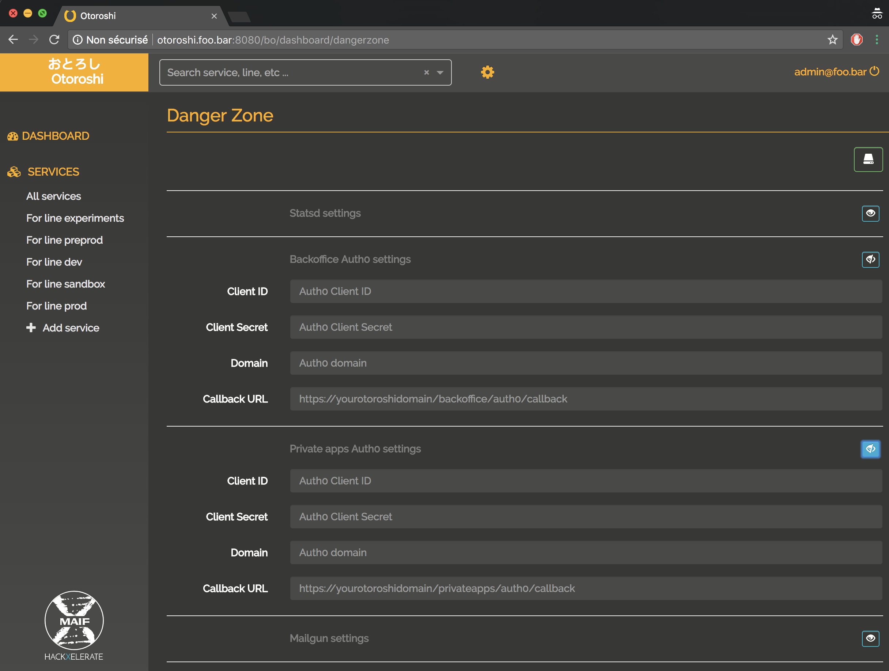

# Auth0

You can use Auth0 to log into Otoroshi's backoffice and Otoroshi's private apps.

Go to `settings (cog icon) / Danger Zone` and expand the `Backoffice Auth0 settings` and `Private apps Auth0 settings` sections.

@@@ div { .centered-img }

@@@

Now, you can fill the following fields :

* `Client Id`
* `Client Service`
* `Domain`

For the `Callback URL` fields, use something like

```
https://otoroshi.foo.bar/backoffice/auth0/callback
https://privateapps.foo.bar/privateapps/auth0/callback
```

Of course, you need to replace `otoroshi.foo.bar` and `privateapps.foo.bar` with your own domain and sub-domains. Don't forget to customize the callback URLs in your Auth0 backoffice too.

Now if you logout, you will see the Auth0 option on the login screen

@@@ div { .centered-img }

@@@
