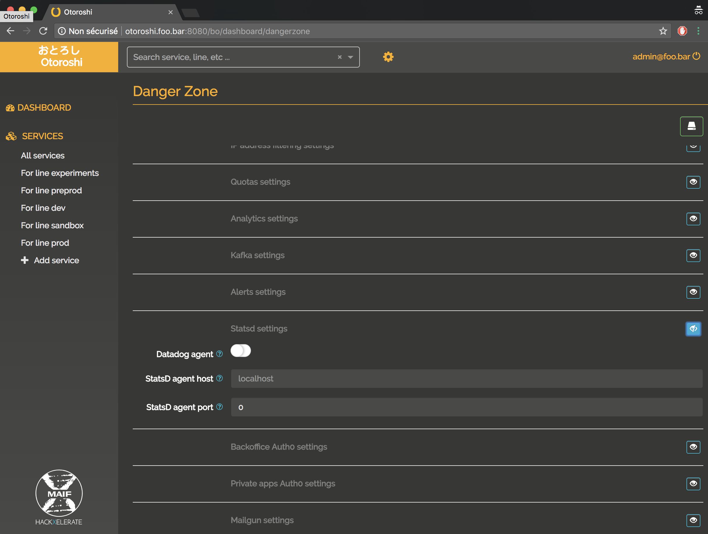

# StatsD / Datadog

Otoroshi provides a StatsD integration to monitor some technical metrics across all your Otoroshi instances.
Go to `settings (cog icon) / Danger Zone` and expand the `Statsd settings` section.

@@@ div { .centered-img }

@@@

Add the host and port of the Statsd agent on your system.
If you're using Datadog, don't forget to check the `Datadog` switch.
