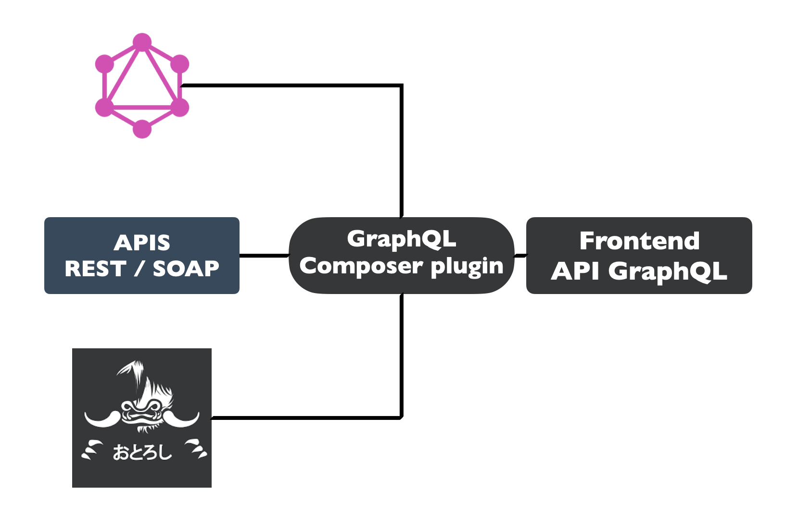

# GraphQL Composer Proxy

The GraphQL Composer proxy is an useful plugin to build an GraphQL API from multiples differents sources, composed of rest api, graphql api or mocked api.

@@@ div { .centered-img }

@@@

You can define, assisted by the UI, a graphQL schema with types, queries and mutations. Otoroshi provides a way to override each field and query with a list of custom directives.

To get a better view of this plugin, you can check the following schema. The goal of this example is to define two types, an user with a name and a password field, and country, which represents all the country with their users. We used three custom directives :

* @ref:[rest](#directives) : to call a http rest service with dynamic path params
* @ref:[permission](#directives) : to restrict the access to the sensitive field
* @ref:[graphql](#directives) : to call a graphQL service by passing a url and the associated query

```js
type Country {
  name: String
  users: [User] @rest(url: "http://localhost:5000/users/${item.name}")
}

type User {
  name: String
  password: String @permission(value: "ADMIN")
}

type Query {
  users: [User] @rest(url: "http://localhost:5000/users", paginate: true)
  user(id: String): RestrictedUser @rest(url: "http://localhost:5000/users/${params.id}")
  countries: [Country] @graphql(url: "https://countries.trevorblades.com", query: "{ countries { name }}")
}
```

Once created and saved in Otoroshi (admitting the existence of an API exposed on 5000 port and with corresponding users endpoints), you can start to call your new GraphQL route by using any http client or easier with the on-board tester. 

## Directives

@@@div { .simple-block }

<div class="simple-block-toggle">
<span class="simple-block-title">Rest</span>
<button class="simple-block-button">Close</button>
</div>

*Arguments : url, method, headers, timeout, data, response_path, response_filter, limit, offset, paginate*

The rest directive is used to expose servers that communicate using the http protocol. The only required argument is the `url`.

**Example**
```js
type Query {
    users(limit: Int, offset: Int): [User] @rest(url: "http://foo.oto.tools/users", method: "GET")
}
```

It can be placed on the field of a query and type. To custom your url queries, you can use the path parameter and another field with respectively, `params` and `item` variables.

**Example**
```js
type Country {
  name: String
  phone: String
  users: [User] @rest(url: "http://foo.oto.tools/users/${item.name}")
}

type Query {
  user(id: String): User @rest(url: "http://foo.oto.tools/users/${params.id}")
}
```
@@@

@@@div { .simple-block }

<div class="simple-block-toggle">
<span class="simple-block-title">GraphQL</span>
<button class="simple-block-button">Close</button>
</div>

*Arguments : url, method, headers, timeout, query, data, response_path, response_filter, limit, offset, paginate*

The rest directive is used to call an other graphql server.

The required argument are the `url` and the `query`.

**Example**
```js
type Query {
    countries: [Country] @graphql(url: "https://countries.trevorblades.com/", query: "{ countries { name phone }}")
}

type Country {
    name: String
    phone: String
}
```
@@@

@@@div { .simple-block }

<div class="simple-block-toggle">
<span class="simple-block-title">Soap</span>
<button class="simple-block-button">Close</button>
</div>
*Arguments: all following arguments*

The soap directive is used to call a soap service. 

```js
type Query {
    randomNumber: String @soap(
        jq_response_filter: ".[\"soap:Envelope\"] | .[\"soap:Body\"] | .[\"m:NumberToWordsResponse\"] | .[\"m:NumberToWordsResult\"]", 
        url: "https://www.dataaccess.com/webservicesserver/numberconversion.wso", 
        envelope: "<?xml version=\"1.0\" encoding=\"utf-8\"?> \n  <soap:Envelope xmlns:soap=\"http://schemas.xmlsoap.org/soap/envelope/\">   \n  <soap:Body>     \n    <NumberToWords xmlns=\"http://www.dataaccess.com/webservicesserver/\">       \n      <ubiNum>12</ubiNum>     \n    </NumberToWords>   \n  </soap:Body> \n</soap:Envelope>")
}
```


##### Specific arguments

| Argument                    | Type      | Optional | Default value |
| --------------------------- | --------- | -------- | ------------- |
| envelope                    | *STRING*  | Required |               |
| url                         | *STRING*  | x        |               |
| action                      | *STRING*  | x        |               |
| preserve_query              | *BOOLEAN* | Required | true          |
| charset                     | *STRING*  | x        |               |
| convert_request_body_to_xml | *BOOLEAN* | Required | true          |
| jq_request_filter           | *STRING*  | x        |               |
| jq_response_filter          | *STRING*  | x        |               |

@@@

@@@div { .simple-block }

<div class="simple-block-toggle">
<span class="simple-block-title">JSON</span>
<button class="simple-block-button">Close</button>
</div>
*Arguments: path, json, paginate*

The json directive can be used to expose static data or mocked data. The first usage is to defined a raw stringify JSON in the `data` argument. The second usage is to set data in the predefined field of the GraphQL plugin composer and to specify a path in the `path` argument.

**Example**
```js
type Query {
    users_from_raw_data: [User] @json(data: "[{\"firstname\":\"Foo\",\"name\":\"Bar\"}]")
    users_from_predefined_data: [User] @json(path: "users")
}
```
@@@

@@@div { .simple-block }

<div class="simple-block-toggle">
<span class="simple-block-title">Mock</span>
<button class="simple-block-button">Close</button>
</div>
*Arguments: url*

The mock directive is to used with the Mock Responses Plugin, also named `Charlatan`. This directive can be interesting to mock your schema and start to use your Otoroshi route before starting to develop the underlying service.

**Example**
```js
type Query {
    users: @mock(url: "/users")
}
```

This example supposes that the Mock Responses plugin is set on the route's feed, and that an endpoint `/users` is available.

@@@


### Permission directives

The permission directives has been created to protect the fields of the graphql schema. The validation process starts by create a `context` for all incoming requests, based on the list of paths defined in the permissions field of the plugin. The permissions paths can refer to the request data (url, headers, etc), user credentials (api key, etc) and informations about the matched route. Then the process can validate that the value or values are present in the `context`.

@@@div { .simple-block }

<div class="simple-block-toggle">
<span class="simple-block-title">Permission</span>
<button class="simple-block-button">Close</button>
</div>

*Arguments : value and unauthorized_value*

The permission directive can be used to secure a field on **one** value. The directive checks that a specific value is present in the `context`.

Two arguments are available, the first, named `value`, is required and designates the value found. The second optional value, `unauthorized_value`, can be used to indicates, in the outcoming response, the rejection message.

**Example**
```js
type User {
    id: String @permission(
        value: "FOO", 
        unauthorized_value: "You're not authorized to get this field")
}
```
@@@

@@@div { .simple-block }

<div class="simple-block-toggle">
<span class="simple-block-title">All permissions</span>
<button class="simple-block-button">Close</button>
</div>

*Arguments : values and unauthorized_value*

This directive is presumably the same as the previous one except that it takes a list of values.

**Example**
```js
type User {
    id: String @allpermissions(
        values: ["FOO", "BAR"], 
        unauthorized_value: "FOO and BAR could not be found")
}
```
@@@

@@@div { .simple-block }

<div class="simple-block-toggle">
<span class="simple-block-title">One permissions of</span>
<button class="simple-block-button">Close</button>
</div>
*Arguments : values and unauthorized_value*

This directive takes a list of values and validate that one of them is in the context.

**Example**
```js
type User {
    id: String @onePermissionsOf(
        values: ["FOO", "BAR"], 
        unauthorized_value: "FOO or BAR could not be found")
}
```
@@@

@@@div { .simple-block }

<div class="simple-block-toggle">
<span class="simple-block-title">Authorize</span>
<button class="simple-block-button">Close</button>
</div>

*Arguments : path, value and unauthorized_value*

The authorize directive has one more required argument, named `path`, which indicates the path to value, in the context. Unlike the last three directives, the authorize directive doesn't search in the entire context but the specified path.

**Example**
```js
type User {
    id: String @authorize(
        path: "$.raw_request.headers.foo", 
        value: "BAR", 
        unauthorized_value: "Bar could not be found in the foo header")
}
```
@@@

### Arguments and theirs types

| Argument           | Type             | Optional                    | Default value |
| ------------------ | ---------------- | --------------------------- | ------------- |
| url                | *STRING*         |                             |               |
| method             | *STRING*         | x                           | GET           |
| headers            | *STRING*         | x                           |               |
| timeout            | *INT*            | x                           | 5000          |
| data               | *STRING*         | x                           |               |
| path               | *STRING*         | x (only for json directive) |               |
| query              | *STRING*         | x                           |               |
| response_path      | *STRING*         | x                           |               |
| response_filter    | *STRING*         | x                           |               |
| limit              | *INT*            | x                           |               |
| offset             | *INT*            | x                           |               |
| value              | *STRING*         |                             |               |
| values             | LIST of *STRING* |                             |
| path               | *STRING*         |                             |               |
| paginate           | *BOOLEAN*        | x                           |               |
| unauthorized_value | *STRING*         | x                           |               |
