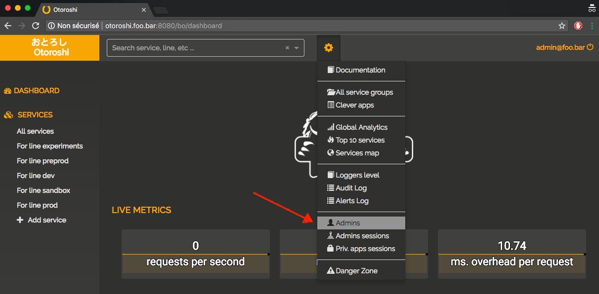
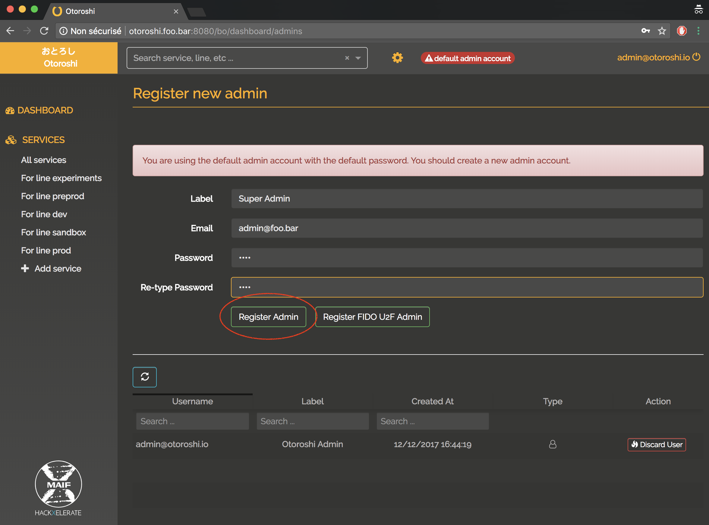
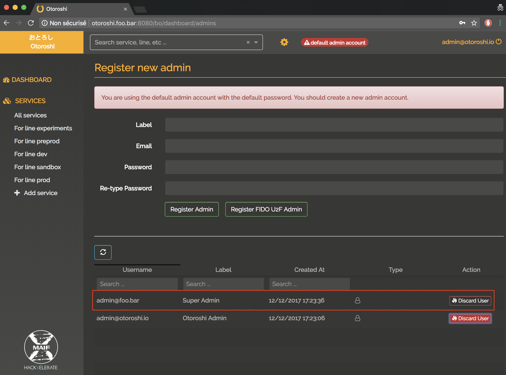
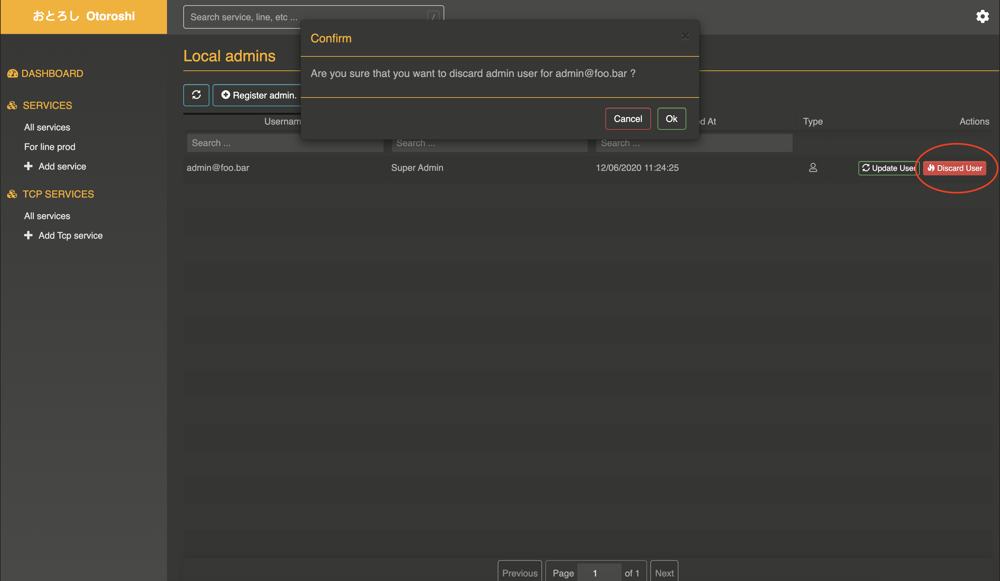

# Manage admin users

@@@ warning
This section is under rewrite. The following content is deprecated and UI may have changed
@@@

## Create admin user after the first run

Click on the `Create an admin user` warning popup, or go to `settings (cog icon) / Admins`.

@@@ div { .centered-img }

@@@

You will see the list of registered admin users.

@@@ div { .centered-img }

@@@

Now, enter informations about the new admin you want to create.

@@@ div { .centered-img }

@@@

Click on `Register Admin`.

@@@ div { .centered-img }

@@@

Now, you can discard the generated admin, confirm, then logout, login with the admin user you have just created and the danger popup will go away

@@@ div { .centered-img }

@@@

## Create admin user with U2F device login

Go to `settings (cog icon) / Admins`.

@@@ div { .centered-img }

@@@

Enter informations about the new admin you want to create.

@@@ div { .centered-img }

@@@

Click on `Register FIDO U2F Admin`.

Otoroshi will  ask you to plug your FIDO U2F device and touch it to complete registration.

@@@ div { .centered-img }

@@@

@@@ warning
To be able to use FIDO U2F devices, Otoroshi must be served over https
@@@

## Discard admin user

Go to `settings (cog icon) / Admins`, at the bottom of the page, you will see a list of admin users that you can discard. Just click on the `Discard User` button on the right side of the row and confirm that you actually want to discard an admin user.

@@@ div { .centered-img }

@@@

## Admin sessions management

Go to `settings (cog icon) / Admins sessions`, you will see a list of active admin user sessions

@@@ div { .centered-img }

@@@

You can either discard single sessions one by one using the `Discard Session` on each targeted row of the list or discard all active sessions using the `Discard all sessions` button at the top of the page.
