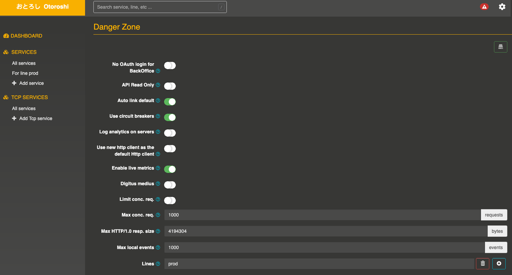
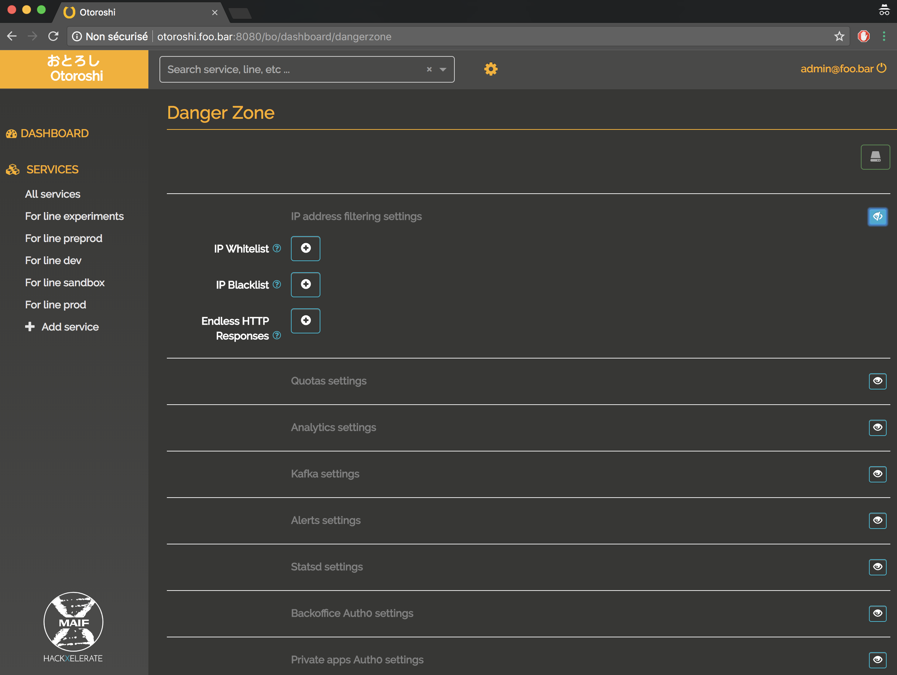
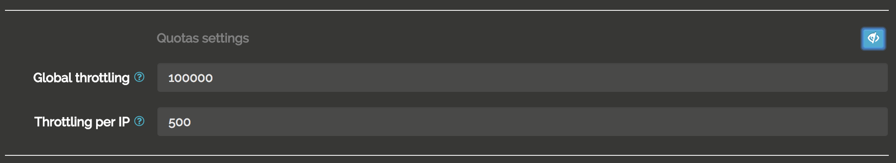

# Configure the Danger zone

@@@ warning
This section is under rewrite. The following content is deprecated and UI may have changed
@@@

Now that you have an actual admin account, go to `setting (cog icon) / Danger Zone` in order to configure your Otoroshi instance.

## Commons settings

This part allows you to configure various things :

* `Maintenance mode` => Switch Otoroshi to maintenance mode
* `No Auth0 login` => allow you to disabled Auth0 login to the Otoroshi admin dashboard
* `API read only` => disable `writes` on the Otoroshi admin api
* `Auto link default` => when no group is specified on a service, it will be assigned to default one
* `Use circuit breakers` => allow usage of circuit breakers for each service
* `Log analytics on servers` => all analytics will be logged on the servers
* `Use new http client as the default Http client` => all http call will use the new http client client by default
* `Enable live metrics` => enable live metrics in the Otoroshi cluster. Performs a lot of writes in the datastore
* `Digitus medius` => change the character of endless HTTP responses from `0` to `🖕`
* `Limit concurrent requests` => allow you to specify a max number of concurrent requests on an Otoroshi instance to avoid overloading
* `Max concurrent requests` => max allowed number of concurrent requests on an Otoroshi instance to avoid overloading
* `Max HTTP/1.0 response size` => max size of an HTTP/1.0 responses, because they are memory mapped
* `Max local events` => number of events stored localy (alerts and audits)
* `lines` => at least one (`prod`). for other, it will allow you to declare urls like `service.line.domain.tld`. For prod it will be `service.domain.tld`

@@@ div { .centered-img }

@@@

## IP address filtering settings

Otoroshi is capable of filtering request by ip address, allowing or blocking requests.

Otoroshi also provides a fun feature called `Endless HTTP responses`. If you put an ip address in that field, then, for any http request on Otoroshi, every response will be 128 GB of `0`.

@@@ div { .centered-img }

@@@

@@@ note
Note that you may provide ip address with wildcard like the following `42.42.*.42` or `42.42.42.*` or `42.42.*.*`
@@@

## Quotas settings

Otoroshi is capable of managing throttling at a global level. Here you can configure number of authorized requests per second on a single Otoroshi instance and the number of authorized request per second for a unique ip address.

@@@ div { .centered-img }

@@@

## Analytics settings - Dashboard datasource

One on the major features of Otoroshi is being able of generating internal `events`. Those `events` are not stored in Otoroshi's datastore but can be sent using a `Exporter`. You can configure those `Exporters` from the `Exporters` page. For more information about `events` and `exporters`, just go to the @ref:[detailed chapter](../usage/10-events.md).

If an `exporter` is setup as an Elastic exporter (with all analytics events sent), Otoroshi can read in this Elastic to render the dashboard, just fill the cluster the Elastic config.

Otoroshi is also capable of reading some analytics and displays it from another MAIF product called `Omoïkane`. As Omoikane is not publicly available yet, is capable of storing events in an [Elastic](https://www.elastic.co/) cluster. For more information about analytics and what it does, just go to the @ref:[detailed chapter](../integrations/analytics.md)

## StatsD settings

Otoroshi is capable of sending internal metrics to a StatsD agent. Just put the host and port of you StatsD agent in the `Danger Zone` to collect these metrics. If you using [Datadog](https://www.datadoghq.com), don't forget to check the dedicated button :)

@@@ div { .centered-img }

@@@

For more information about StatsD integration and what it does, just go to the @ref:[detailed chapter](../integrations/statsd.md)

## Backoffice auth. settings
<!-- TODO -->

## Let's encrypt settings
<!-- TODO -->

## CleverCloud settings

As we built our products to run on Clever-Cloud, Otoroshi has a close integration with Clever-Cloud. In this section of `Danger Zone` you can configure how to access Clever-Cloud API.

To generate the needed value, please refers to [Clever-Cloud documentation](https://www.clever-cloud.com/doc/clever-cloud-apis/cc-api/)

@@@ div { .centered-img }

@@@

For more information about Clever-Cloud integration and what it does, just go to the @ref:[detailed chapter](../integrations/clevercloud.md)

## Global scripts
<!-- TODO -->

## Proxies
<!-- TODO -->

## User-Agent extraction settings
<!-- TODO -->

## Geolocation extraction settings
<!-- TODO -->

## Tls settings
<!-- TODO -->

## Auto generate certificates
<!-- TODO -->

## Global metadata
<!-- TODO -->

## Import / exports and panic mode

For more details about imports and exports, please go to the @ref:[dedicated chapter](../setup/importsexports.md)

About panic mode, it's an unusual feature that allows you to discard all current admin. sessions, allows only admin users with U2F devices to log back, and pass the API in read-only mode. Only a person who has access to Otoroshi's datastore will be able to turn it back on.
