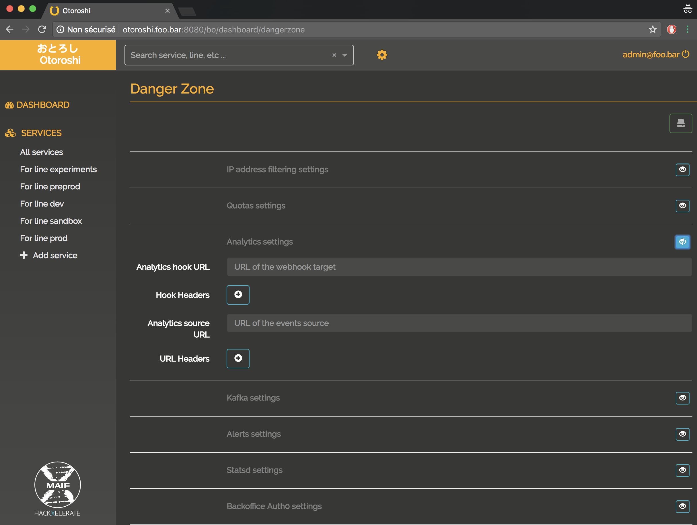
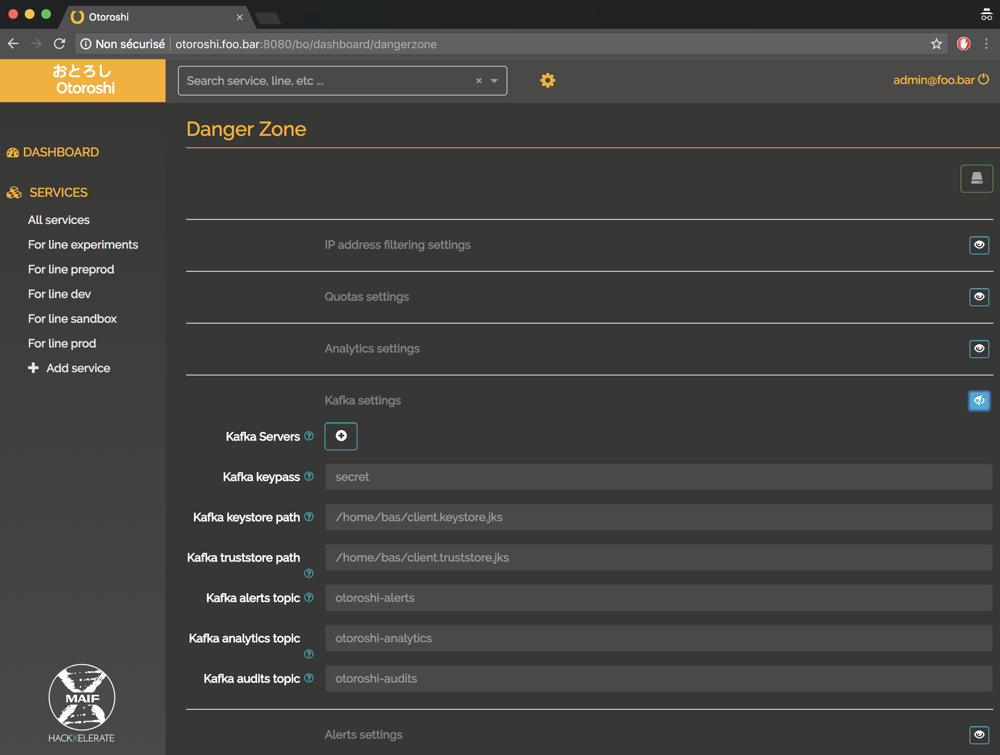
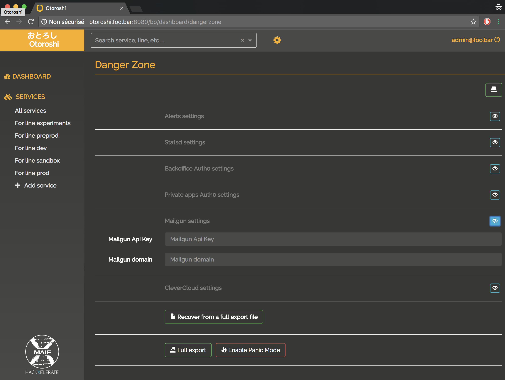
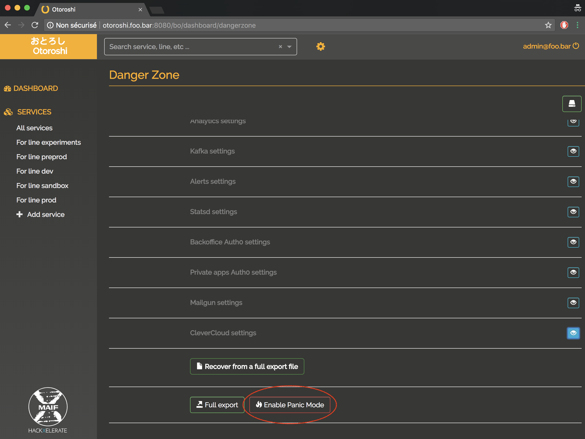

# Configure the Danger zone 

now that you have an actual admin account, got to `setting (cog icon) / Danger Zone` in order to configure your Otoroshi instance.

@@@ div { .centered-img }

@@@

## Commons settings

@@@ div { .centered-img }

@@@

## Whitelist / blacklist settings

@@@ div { .centered-img }

@@@

## Global throttling settings

@@@ div { .centered-img }

@@@

## Analytics settings

@@@ div { .centered-img }

@@@

## Kafka settings

@@@ div { .centered-img }

@@@

## Alerts settings

Each time a dangerous actions or something unusual is happening on Otoroshi, it will create an alert and store it. You can ne notified for each of those alerts using `WebHooks` or emails. To do so, just add the `WebHook` URL and optional headers in the `Danger Zone` or any email address you want (you can add more than one email address). 

@@@ div { .centered-img }

@@@

## StatsD settings

Otoroshi is capable of sending internal metrics to a StatsD agent. Just put the host and port of you StatsD agent in the `Danger Zone` to collect those metrics. If you using [Datadog](https://www.datadoghq.com), don't forget to check the dedicated button :)

@@@ div { .centered-img }

@@@

## Auth0 settings 

It is possible to configure Otoroshi to allow admins to log in through auth0. Also, Otoroshi provides a feature called `Private apps.` that allow you to force login to an auth0 domain before accessing an app. You can create an Auth0 client (https://manage.auth0.com/#/clients) for each of those features (admins login and private apps. login) and customize it with any rule you want (don't forget allowed callbacks, like `http://otoroshi.foo.bar:8080/backoffice/auth0/callback` and `http://privateapps.foo.bar:8080/backoffice/auth0/callback`). 

Once it's done, go to the settings of each client (https://manage.auth0.com/#/clients/xxxxxxxxxxxxxxxx/settings) to get the informations needed for the `Danger Zone`.

@@@ div { .centered-img }

@@@

@@@ div { .centered-img }

@@@

## Mailgun settings

If you want to send email for every alert generated by Otoroshi, you need to configure your Mailgun credentials in the `Danger Zone`. Those informations are provided in you Mailgun domain dashboard (ie. https://app.mailgun.com/app/domains/my.domain.foo.bar) in the information section.

@@@ div { .centered-img }

@@@

## CleverCloud settings

As we built our products to run on Clever-Cloud, Otoroshi has a close integration with Clever-Cloud. In this section of `Danger Zone` you can configure how to access Clever-Cloud API. 

To generate the needed value, please refers to [Clever-Cloud documentation](https://www.clever-cloud.com/doc/clever-cloud-apis/cc-api/)

@@@ div { .centered-img }

@@@

for more informations about Clever-Cloud integration and what it does, just go to the @ref:[detailed chapter](../integrations/clevercloud.md)

## Import / exports and panic mode

for more details about imports / exports, please go to the @ref:[dedicated chapter](../othertasks/importsexports.md)

About panic mode, it's a unusual feature that allow you to discard all current admin. sessions, allow only admin. with U2F devices to log back, and pass the API in read only mode. Only a person with access to the Otoroshi datastore will be able to turn it back.

@@@ div { .centered-img }

@@@
