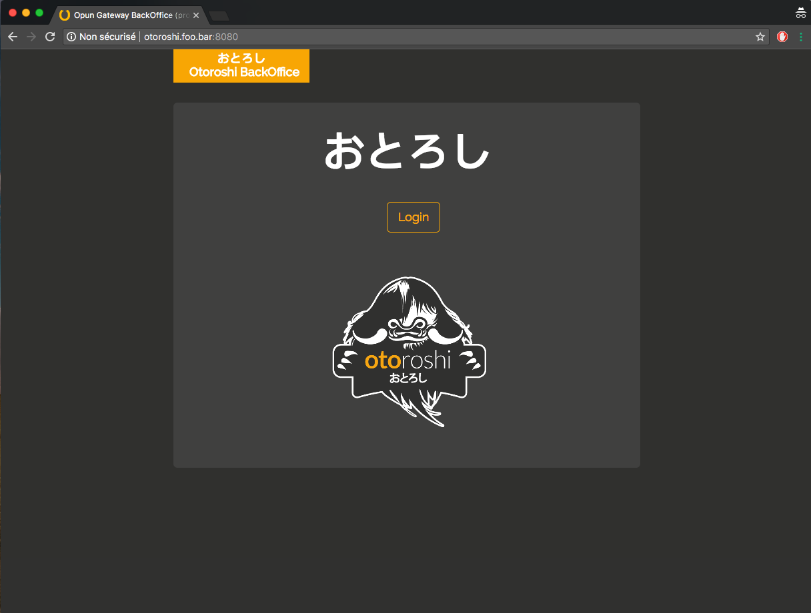

# Setup Otoroshi

Now that Otoroshi is running, you are ready to log into the Otoroshi admin dashboard and setup your instance. Just go to 

<a href="http://otoroshi.foo.bar:8080" target="_blank">http://otoroshi.foo.bar:8080</a>

@@@ div { .centered-img }

@@@

and use the credentials generated in Otoroshi boot logs.

@@@ div { .centered-img }

@@@

(of course, you can change this url dependending on the configuration you provided to Otoroshi).

Once logged in, the first screen you should see will look like

@@@ div { .centered-img }

@@@

as you can see, Otoroshi is not really happy about you being logged with a generated admin account. 

But we will fix that in the next chapter

@@@ index

* [create admins](./admin.md)
* [configure danger zone](./dangerzone.md)

@@@