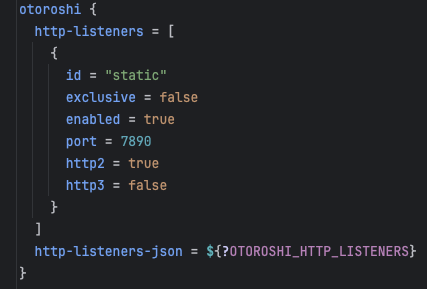
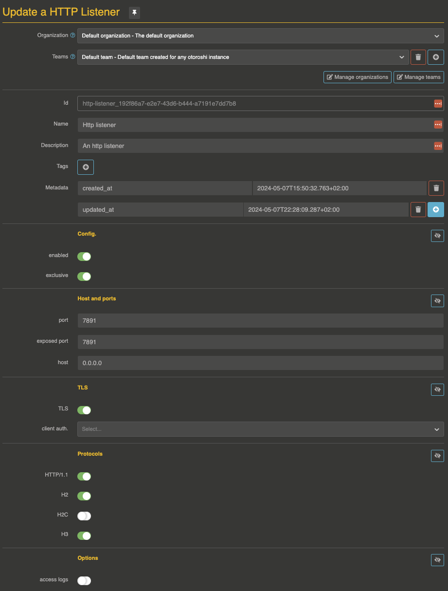
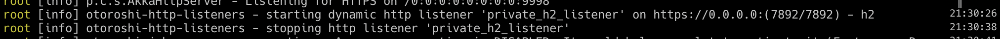

# Custom HTTP Listeners

Starting from v16.18.0, Otoroshi supports custom HTTP listeners. This feature lets you run additional HTTP listeners on any port, with the protocols and TLS settings you want. Listeners can be defined statically from the configuration file or dynamically via the admin API.

Each listener runs an independent Netty server and is fully capable of routing traffic like the standard Otoroshi listener. Additionally, listeners can **scope traffic** to specific routes or plugins using the `bound_listeners` mechanism, enabling powerful multi-port deployment patterns.

## Listener configuration

The configuration of an HTTP listener uses the following properties:

| Property | Type | Default | Description |
|----------|------|---------|-------------|
| `enabled` | boolean | `true` | Whether the listener is active |
| `exclusive` | boolean | `false` | When `true`, the listener only serves routes explicitly bound to it. See [exclusive listeners](#exclusive-listeners) |
| `tls` | boolean | `true` | Enable TLS (HTTPS). When `false`, the listener uses plain HTTP |
| `http1` | boolean | `true` | Enable HTTP/1.1 protocol support |
| `http2` | boolean | `true` | Enable HTTP/2 protocol support (ALPN negotiation over TLS) |
| `h2c` | boolean | `false` | Enable HTTP/2 Cleartext (HTTP/2 without TLS, for internal networks) |
| `http3` | boolean | `false` | Enable HTTP/3 (QUIC). Requires `tls: true`. Runs on a separate UDP socket on the same port |
| `port` | number | `7890` | The port the listener binds to |
| `exposedPort` | number | same as `port` | The externally visible port (useful behind load balancers, proxies, or in containers) |
| `host` | string | `0.0.0.0` | The network interface the listener binds to. Use `0.0.0.0` for all interfaces or `127.0.0.1` for localhost only |
| `accessLog` | boolean | `false` | Enable access logging for this listener |
| `clientAuth` | string | `None` | mTLS client authentication mode: `None`, `Want` (optional), or `Need` (required) |

### JSON example

```json
{
  "enabled": true,
  "exclusive": false,
  "tls": true,
  "http1": true,
  "http2": true,
  "h2c": false,
  "http3": false,
  "port": 7890,
  "exposedPort": 7890,
  "host": "0.0.0.0",
  "accessLog": false,
  "clientAuth": "None"
}
```

## Exclusive listeners

An exclusive listener (marked with `exclusive: true`) **only serves routes that are explicitly bound to it**. Routes without a `bound_listeners` entry will never be served on an exclusive listener.

This is useful for:

* **Private APIs**: expose internal routes on a separate port that is only accessible from a private network
* **Protocol isolation**: run a dedicated listener for specific protocols (e.g., gRPC over H2)
* **Security boundaries**: enforce different TLS or mTLS settings per listener

When a listener is **not exclusive** (the default), it serves:

* All routes that are explicitly bound to it
* All routes that have no `bound_listeners` (i.e., routes available on any listener)

## Static HTTP listeners

You can define HTTP listeners directly in the Otoroshi configuration file. They start at boot time as soon as the admin extensions are initialized.

Add listener configurations under `otoroshi.admin-extensions.configurations.otoroshi_extensions_httplisteners.listeners`:

```hocon
otoroshi {
  admin-extensions {
    configurations {
      otoroshi_extensions_httplisteners {
        listeners = [
          {
            id = "internal-api"
            enabled = true
            exclusive = true
            tls = true
            http1 = true
            http2 = true
            port = 9443
            exposedPort = 9443
            host = "0.0.0.0"
            clientAuth = "Need"
          },
          {
            id = "public-h3"
            enabled = true
            exclusive = false
            tls = true
            http1 = true
            http2 = true
            http3 = true
            port = 8443
            exposedPort = 443
          }
        ]
      }
    }
  }
}
```

You can also provide the configuration as a JSON string using `listeners_json`, or set the `OTOROSHI_HTTP_LISTENERS` environment variable with a JSON array.

Static listeners **must have an `id` field** so that routes and plugins can reference them via `bound_listeners`.

@@@ div { .centered-img }

@@@

## Dynamic HTTP listeners

Dynamic listeners are managed through the admin API or the back-office UI. They are created, updated, and deleted at runtime without restarting Otoroshi.

@@@ div { .centered-img }

@@@

### Lifecycle

* **Create**: as soon as a new `HttpListener` entity is created, the corresponding Netty server starts
* **Update**: if the configuration changes, the listener is stopped and restarted with the new settings
* **Disable**: setting `enabled: false` stops the listener without deleting the entity
* **Delete**: deleting the entity stops the listener and removes it

### Example: create an H2-only exclusive listener

```sh
curl -X POST 'http://otoroshi-api.oto.tools:8080/apis/http-listeners.proxy.otoroshi.io/v1/http-listeners' \
  -H 'Content-Type: application/json' \
  -u admin-api-apikey-id:admin-api-apikey-secret \
  -d '{
    "id": "private_h2_listener",
    "name": "Private H2 Listener",
    "description": "H2-only exclusive listener for internal gRPC services",
    "tags": ["internal"],
    "metadata": {},
    "config": {
      "enabled": true,
      "exclusive": true,
      "tls": true,
      "http1": false,
      "http2": true,
      "h2c": false,
      "http3": false,
      "port": 7892,
      "exposedPort": 7892,
      "host": "0.0.0.0",
      "accessLog": true,
      "clientAuth": "None"
    }
  }'
```

A few seconds later, a log entry will appear:

@@@ div { .centered-img }

@@@

### Example: disable a listener

```sh
curl -X PATCH 'http://otoroshi-api.oto.tools:8080/apis/http-listeners.proxy.otoroshi.io/v1/http-listeners/private_h2_listener' \
  -H 'Content-Type: application/json' \
  -u admin-api-apikey-id:admin-api-apikey-secret \
  -d '[{"op": "replace", "path": "/config/enabled", "value": false}]'
```

@@@ div { .centered-img }

@@@

### Example: delete a listener

```sh
curl -X DELETE 'http://otoroshi-api.oto.tools:8080/apis/http-listeners.proxy.otoroshi.io/v1/http-listeners/private_h2_listener' \
  -u admin-api-apikey-id:admin-api-apikey-secret
```

## Bind a route to a specific HTTP listener

Routes have a `bound_listeners` property (array of listener IDs). When a route is bound to one or more listeners, it is **only accessible on those listeners** and no longer served on the standard listener.

For instance, the following route is only accessible from the listener with ID `static-1`. The standard HTTP listener will not route it:

```json
{
  "id": "route_private_api",
  "name": "my private api",
  "description": "Only accessible on the static-1 listener",
  "enabled": true,
  "debug_flow": false,
  "export_reporting": false,
  "capture": false,
  "groups": ["default"],
  "bound_listeners": ["static-1"],
  "frontend": {
    "domains": ["myapi.oto.tools"],
    "strip_path": true,
    "exact": false,
    "headers": {},
    "query": {},
    "methods": []
  },
  "backend": {
    "targets": [
      {
        "id": "target_1",
        "hostname": "internal-service.local",
        "port": 8080,
        "tls": false,
        "weight": 1,
        "protocol": "HTTP/1.1"
      }
    ],
    "root": "",
    "rewrite": false,
    "load_balancing": { "type": "RoundRobin" }
  },
  "backend_ref": null,
  "plugins": []
}
```

## Bind a plugin to a specific HTTP listener

For more granular control, individual plugins within a route can also be bound to specific listeners using the `bound_listeners` property on each plugin slot. This allows a route to be accessible on all listeners but apply certain plugins only on specific ones.

In the following example, the `ApikeyCalls` plugin is only applied when the request comes through the `static-1` listener. The `OverrideHost` plugin runs on all listeners:

```json
{
  "id": "route_selective_plugins",
  "name": "my api with selective auth",
  "description": "API key required only on the static-1 listener",
  "enabled": true,
  "debug_flow": false,
  "export_reporting": false,
  "capture": false,
  "groups": ["default"],
  "bound_listeners": [],
  "frontend": {
    "domains": ["myapi.oto.tools"],
    "strip_path": true,
    "exact": false,
    "headers": {},
    "query": {},
    "methods": []
  },
  "backend": {
    "targets": [
      {
        "id": "target_1",
        "hostname": "request.otoroshi.io",
        "port": 443,
        "tls": true,
        "weight": 1,
        "protocol": "HTTP/1.1"
      }
    ],
    "root": "",
    "rewrite": false,
    "load_balancing": { "type": "RoundRobin" }
  },
  "backend_ref": null,
  "plugins": [
    {
      "enabled": true,
      "debug": false,
      "plugin": "cp:otoroshi.next.plugins.ApikeyCalls",
      "include": [],
      "exclude": [],
      "config": {},
      "bound_listeners": ["static-1"],
      "plugin_index": {
        "validate_access": 0,
        "transform_request": 0,
        "match_route": 0
      }
    },
    {
      "enabled": true,
      "debug": false,
      "plugin": "cp:otoroshi.next.plugins.OverrideHost",
      "include": [],
      "exclude": [],
      "config": {},
      "bound_listeners": [],
      "plugin_index": {
        "transform_request": 1
      }
    }
  ]
}
```

## Protocol support details

### HTTP/1.1

Enabled by default. Standard HTTP/1.1 with keep-alive, chunked transfer encoding, and pipelining.

### HTTP/2

Enabled by default over TLS via ALPN negotiation. Provides multiplexed streams, header compression (HPACK), and server push capabilities. When `h2c` is enabled, HTTP/2 cleartext is also available without TLS (useful for internal service-to-service communication).

### HTTP/3

HTTP/3 runs over the QUIC protocol (UDP). It requires TLS to be enabled (`tls: true`). When activated, Otoroshi starts a separate UDP socket on the same port. HTTP/3 provides faster connection establishment (0-RTT), better handling of packet loss, and connection migration.

### TLS and mTLS

Each listener manages its own TLS context with:

* **Dynamic certificate selection**: Otoroshi automatically selects the right certificate based on SNI (Server Name Indication)
* **Independent mTLS settings**: each listener can have different `clientAuth` settings (`None`, `Want`, `Need`)
* **Shared cipher suites and TLS protocols**: inherited from the global Otoroshi TLS configuration (`otoroshi.ssl.cipherSuites` and `otoroshi.ssl.protocols`)

## Routing behavior summary

The following table summarizes how routes are matched depending on the listener type and the route's `bound_listeners` configuration:

| Listener type | Route `bound_listeners` | Served? |
|---------------|------------------------|---------|
| Standard | empty | Yes |
| Standard | `["listener-a"]` | No |
| Non-exclusive custom | empty | Yes |
| Non-exclusive custom (`listener-a`) | `["listener-a"]` | Yes |
| Non-exclusive custom (`listener-a`) | `["listener-b"]` | No |
| Exclusive (`listener-a`) | empty | No |
| Exclusive (`listener-a`) | `["listener-a"]` | Yes |
| Exclusive (`listener-a`) | `["listener-b"]` | No |

## Use cases

* **Internal/external separation**: run an exclusive listener on a private port (e.g., `9443`) for admin and internal APIs, while the standard listener serves public traffic
* **Protocol specialization**: dedicate a listener with `http1: false` for gRPC or HTTP/2-only services
* **mTLS enforcement**: run a listener with `clientAuth: Need` for partner integrations that require mutual TLS, without affecting other routes
* **Multi-port deployment**: serve admin UI, public API, and webhooks on different ports from the same Otoroshi instance
* **Selective access logging**: enable `accessLog` only on listeners that handle sensitive traffic
* **HTTP/3 migration**: run an HTTP/3 listener alongside HTTP/1.1+HTTP/2 for gradual client adoption

## Admin API

```
GET    /apis/http-listeners.proxy.otoroshi.io/v1/http-listeners              # List all listeners
POST   /apis/http-listeners.proxy.otoroshi.io/v1/http-listeners              # Create a listener
GET    /apis/http-listeners.proxy.otoroshi.io/v1/http-listeners/:id          # Get a listener
PUT    /apis/http-listeners.proxy.otoroshi.io/v1/http-listeners/:id          # Update a listener
PATCH  /apis/http-listeners.proxy.otoroshi.io/v1/http-listeners/:id          # Partially update a listener
DELETE /apis/http-listeners.proxy.otoroshi.io/v1/http-listeners/:id          # Delete a listener
GET    /apis/http-listeners.proxy.otoroshi.io/v1/http-listeners/_count       # Count listeners
GET    /apis/http-listeners.proxy.otoroshi.io/v1/http-listeners/_template    # Get a listener template
POST   /apis/http-listeners.proxy.otoroshi.io/v1/http-listeners/_bulk        # Bulk create
PUT    /apis/http-listeners.proxy.otoroshi.io/v1/http-listeners/_bulk        # Bulk update
PATCH  /apis/http-listeners.proxy.otoroshi.io/v1/http-listeners/_bulk        # Bulk patch
DELETE /apis/http-listeners.proxy.otoroshi.io/v1/http-listeners/_bulk        # Bulk delete
```

## Related

* @ref:[HTTP Listeners entity](../entities/http-listeners.md) - Entity reference documentation
* @ref:[Routes](../entities/routes.md) - Route configuration including `bound_listeners`
