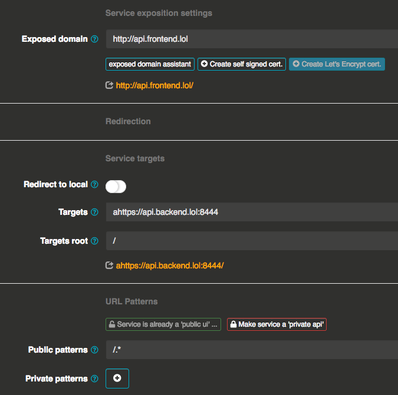
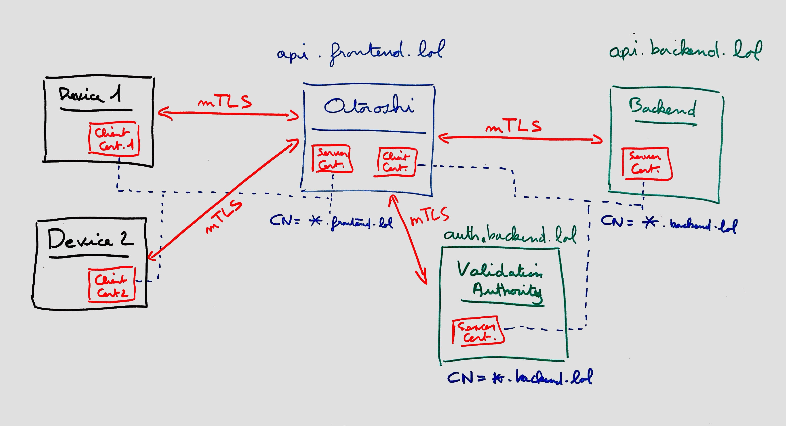

# Mutual TLS with Otoroshi

Otoroshi support mutual TLS out of the box. mTLS from client to Otoroshi and from Otoroshi to targets are supported. In this article we will see how to configure Otoroshi to use end-to-end mTLS. All code and files used in this articles can be found on the [Otoroshi github](https://github.com/MAIF/otoroshi/tree/master/demos/mtls)

## End-to-end mTLS

The use case is the following :

@@@ div { .centered-img }

@@@

for this demo you will have to edit your `/etc/hosts` file to add the following entries

```
127.0.0.1    otoroshi-api.foo.bar otoroshi.foo.bar otoroshi-admin-internal-api.foo.bar privateapps.foo.bar 
127.0.0.1    api.backend.lol api.frontend.lol 
```

### Create certificates

But first we need to generate some certificates to make the demo work

```sh
mkdir mtls-demo
cd mtls-demo
mkdir ca
mkdir server
mkdir client

# create a certificate authority key, use password as pass phrase
openssl genrsa -out ./ca/ca-backend.key 2048
# remove pass phrase
openssl rsa -in ./ca/ca-backend.key -out ./ca/ca-backend.key
# generate the certificate authority cert
openssl req -new -x509 -sha256 -days 730 -key ./ca/ca-backend.key -out ./ca/ca-backend.cer -subj "/CN=otoroshi-mtls-demo-backend"


# create a certificate authority key, use password as pass phrase
openssl genrsa -out ./ca/ca-frontend.key 2048
# remove pass phrase
openssl rsa -in ./ca/ca-frontend.key -out ./ca/ca-frontend.key
# generate the certificate authority cert
openssl req -new -x509 -sha256 -days 730 -key ./ca/ca-frontend.key -out ./ca/ca-frontend.cer -subj "/CN=otoroshi-mtls-demo-frontend"


# now create the backend cert key, use password as pass phrase
openssl genrsa -out ./server/_.backend.lol.key 2048
# remove pass phrase
openssl rsa -in ./server/_.backend.lol.key -out ./server/_.backend.lol.key
# generate the csr for the certificate
openssl req -new -key ./server/_.backend.lol.key -sha256 -out ./server/_.backend.lol.csr -subj "/CN=*.backend.lol"
# generate the certificate
openssl x509 -req -days 365 -sha256 -in ./server/_.backend.lol.csr -CA ./ca/ca-backend.cer -CAkey ./ca/ca-backend.key -set_serial 1 -out ./server/_.backend.lol.cer
# verify the certificate, should output './server/_.backend.lol.cer: OK'
openssl verify -CAfile ./ca/ca-backend.cer ./server/_.backend.lol.cer


# now create the frontend cert key, use password as pass phrase
openssl genrsa -out ./server/_.frontend.lol.key 2048
# remove pass phrase
openssl rsa -in ./server/_.frontend.lol.key -out ./server/_.frontend.lol.key
# generate the csr for the certificate
openssl req -new -key ./server/_.frontend.lol.key -sha256 -out ./server/_.frontend.lol.csr -subj "/CN=*.frontend.lol"
# generate the certificate
openssl x509 -req -days 365 -sha256 -in ./server/_.frontend.lol.csr -CA ./ca/ca-frontend.cer -CAkey ./ca/ca-frontend.key -set_serial 1 -out ./server/_.frontend.lol.cer
# verify the certificate, should output './server/_.frontend.lol.cer: OK'
openssl verify -CAfile ./ca/ca-frontend.cer ./server/_.frontend.lol.cer


# now create the client cert key for backend, use password as pass phrase
openssl genrsa -out ./client/_.backend.lol.key 2048
# remove pass phrase
openssl rsa -in ./client/_.backend.lol.key -out ./client/_.backend.lol.key
# generate the csr for the certificate
openssl req -new -key ./client/_.backend.lol.key -out ./client/_.backend.lol.csr -subj "/CN=*.backend.lol"
# generate the certificate
openssl x509 -req -days 365 -sha256 -in ./client/_.backend.lol.csr -CA ./ca/ca-backend.cer -CAkey ./ca/ca-backend.key -set_serial 2 -out ./client/_.backend.lol.cer
# generate a pkcs12 version of the cert and key, use password as password
openssl pkcs12 -export -clcerts -in client/_.backend.lol.cer -inkey client/_.backend.lol.key -out client/_.backend.lol.p12


# now create the client cert key for frontend, use password as pass phrase
openssl genrsa -out ./client/_.frontend.lol.key 2048
# remove pass phrase
openssl rsa -in ./client/_.frontend.lol.key -out ./client/_.frontend.lol.key
# generate the csr for the certificate
openssl req -new -key ./client/_.frontend.lol.key -out ./client/_.frontend.lol.csr -subj "/CN=*.frontend.lol"
# generate the certificate
openssl x509 -req -days 365 -sha256 -in ./client/_.frontend.lol.csr -CA ./ca/ca-frontend.cer -CAkey ./ca/ca-frontend.key -set_serial 2 -out ./client/_.frontend.lol.cer
# generate a pkcs12 version of the cert and key, use password as password
openssl pkcs12 -export -clcerts -in client/_.frontend.lol.cer -inkey client/_.frontend.lol.key -out client/_.frontend.lol.p12
```

once it's done, you should have something like

```sh
$ tree
.
├── backend.js
├── ca
│   ├── ca-backend.cer
│   ├── ca-backend.key
│   ├── ca-frontend.cer
│   └── ca-frontend.key
├── client
│   ├── _.backend.lol.cer
│   ├── _.backend.lol.csr
│   ├── _.backend.lol.key
│   ├── _.backend.lol.p12
│   ├── _.frontend.lol.cer
│   ├── _.frontend.lol.csr
│   ├── _.frontend.lol.key
│   └── _.frontend.lol.p12
└── server
    ├── _.backend.lol.cer
    ├── _.backend.lol.csr
    ├── _.backend.lol.key
    ├── _.frontend.lol.cer
    ├── _.frontend.lol.csr
    └── _.frontend.lol.key

3 directories, 18 files
```

### The backend service 

now, let's create a backend service using nodejs. Create a file named `backend.js`

```sh
touch backend.js
```

and put the following content

```js
const fs = require('fs'); 
const https = require('https'); 

const options = { 
  key: fs.readFileSync('./server/_.backend.lol.key'), 
  cert: fs.readFileSync('./server/_.backend.lol.cer'), 
  ca: fs.readFileSync('./ca/ca-backend.cer'), 
}; 

https.createServer(options, (req, res) => { 
  res.writeHead(200, {
    'Content-Type': 'application/json'
  }); 
  res.end(JSON.stringify({ message: 'Hello World!' }) + "\n"); 
}).listen(8444);
```

to run the server, just do 

```sh
node ./backend.js
```

now you can try your server with

```sh
curl -k https://api.backend.lol:8444/
# will print {"message":"Hello World!"}
```

now modify your backend server to ensure that the client provides a client certificate like:

```js
const fs = require('fs'); 
const https = require('https'); 

const options = { 
  key: fs.readFileSync('./server/_.backend.lol.key'), 
  cert: fs.readFileSync('./server/_.backend.lol.cer'), 
  ca: fs.readFileSync('./ca/ca-backend.cer'), 
  requestCert: true, 
  rejectUnauthorized: true
}; 

https.createServer(options, (req, res) => { 
  console.log('Client certificate CN: ', req.socket.getPeerCertificate().subject.CN);
  res.writeHead(200, {
    'Content-Type': 'application/json'
  }); 
  res.end(JSON.stringify({ message: 'Hello World!' }) + "\n"); 
}).listen(8444);
```

you can test your new server with

```sh
curl -k --cert-type pkcs12 --cert ./client/_.backend.lol.p12:password https://api.backend.lol:8444/
# will print {"message":"Hello World!"}
```

### Otoroshi setup

Download the latest version of the Otoroshi jar and run it like

```sh
java -jar otoroshi.jar

[info] otoroshi-env - Admin API exposed on http://otoroshi-api.foo.bar:8080
[info] otoroshi-env - Admin UI  exposed on http://otoroshi.foo.bar:8080
[info] otoroshi-in-memory-datastores - Now using InMemory DataStores
[info] otoroshi-env - The main datastore seems to be empty, registering some basic services
[info] otoroshi-env - You can log into the Otoroshi admin console with the following credentials: admin@otoroshi.io / xxxxxxxxxxxx
[info] play.api.Play - Application started (Prod)
[info] p.c.s.AkkaHttpServer - Listening for HTTP on /0:0:0:0:0:0:0:0:8080
[info] p.c.s.AkkaHttpServer - Listening for HTTPS on /0:0:0:0:0:0:0:0:8443
[info] otoroshi-env - Generating a self signed SSL certificate for https://*.foo.bar ...
```

and log into otoroshi with the tuple `admin@otoroshi.io / xxxxxxxxxxxx` displayed in the logs. Once logged in, create a new public service exposed on `http://api.frontend.lol` that targets `ahttps://api.backend.lol:8444/`.

@@@ div { .centered-img }

@@@

and test it

```sh
curl http://api.frontend.lol:8080/
# the following error should be returned: {"Otoroshi-Error":"Something went wrong, you should try later. Thanks for your understanding."}
```

@@@ warning
As seen before, the target of the otoroshi service is `ahttps://api.backend.lol:8444/`. `ahttps://` is not a type and is intended. This tells otoroshi to use its experimental `akka-http client` with dynamic tls support to fetch this resource.
@@@

you should get an error due to the fact that Otoroshi doesn't know about the server certificate or the client certificate expected by the server.

We have to add the client certificate for `https://api.backend.lol` to Otoroshi. Go to http://otoroshi.foo.bar:8080/bo/dashboard/certificates and create a new item. Copy and paste the content of `./client/_.backend.lol.cer` and `./client/_.backend.lol.key` respectively in `Certificate full chain` and `Certificate private key`.

@@@ div { .centered-img }

@@@

and retry the following curl command 

```sh
curl http://api.frontend.lol:8080/
# the output should be: {"message":"Hello World!"}
```

now we have to expose `https://api.frontend.lol:8443` using otoroshi. Go to http://otoroshi.foo.bar:8080/bo/dashboard/certificates and create a new item. Copy and paste the content of `./server/_.frontend.lol.cer` and `./server/_.frontend.lol.key` respectively in `Certificate full chain` and `Certificate private key`.

and try the following command

```sh
curl -k https://api.frontend.lol:8443/
# the output should be: {"message":"Hello World!"}
```

now we have to enforce the fact that we want client certificate for `api.frontend.lol`. To do that, we have to create a `Validation authority` in otoroshi and use it on the `api.frontend.lol` service. Go to http://otoroshi.foo.bar:8080/bo/dashboard/validation-authorities and create a new item. A validation authority is supposed to be a remote service that will say if the client certificate is valid. Here we don't really care if the certificate is valid or not, but we want to enforce the fact that there is a client certificate. So just check the `All cert. valid button`.

@@@ div { .centered-img }

@@@

now go back on your `api.frontend.lol` service, in the `Validation authority` section and select the authority you just created.

@@@ div { .centered-img }

@@@

now if you retry 

```sh
curl -k https://api.frontend.lol:8443/
# the output should be: {"Otoroshi-Error":"You're not authorized here !"}
```

you should get an error because no client cert. is passed with the request. But if you pass the `./client/_.frontend.lol.p12` client cert in your curl call

```sh
curl -k --cert-type pkcs12 --cert ./client/_.frontend.lol.p12:password https://api.frontend.lol:8443/
# the output should be: {"message":"Hello World!"}
```

## Going further

The use case is the following :

@@@ div { .centered-img }

@@@

```js
const fs = require('fs'); 
const https = require('https'); 

const options = { 
  key: fs.readFileSync('./server/_.backend.lol.key'), 
  cert: fs.readFileSync('./server/_.backend.lol.cer'), 
  ca: fs.readFileSync('./ca/ca-frontend.cer'), 
  requestCert: true, 
  rejectUnauthorized: true
}; 

function decodeBody(req) {
  return new Promis((success, failure) => {
    const body = [];
    request.on('data', (chunk) => {
      body.push(chunk);
    }).on('end', () => {
      const bodyStr = Buffer.concat(body).toString();
      success(JSON.parse(bodyStr));
    });
  });
}

https.createServer(options, (req, res) => { 
  decodeBody(req).then(body => {
    const user = body.user;
    const chain = body.chain;
  });
  console.log('Client certificate CN: ', req.socket.getPeerCertificate().subject.CN);
  res.writeHead(200, {
    'Content-Type': 'application/json'
  }); 
  res.end(JSON.stringify({ message: 'Hello World!' }) + "\n"); 
}).listen(8444);
```