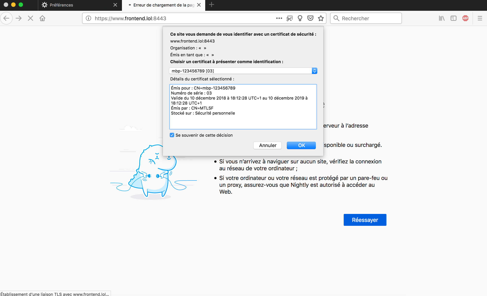
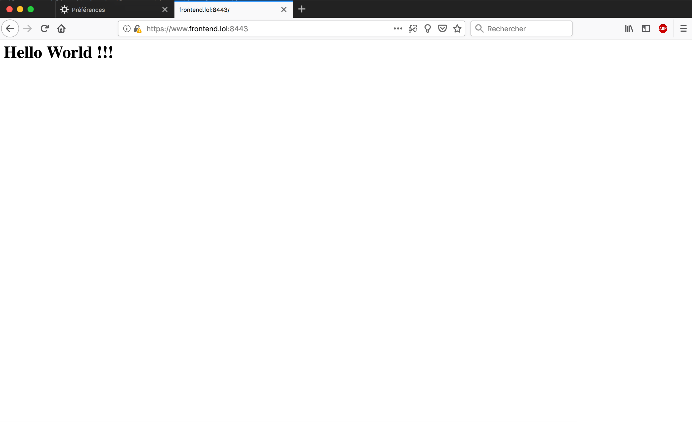

# Mutual TLS with Otoroshi

Otoroshi support mutual TLS out of the box. mTLS from client to Otoroshi and from Otoroshi to targets are supported. In this article we will see how to configure Otoroshi to use end-to-end mTLS. All code and files used in this articles can be found on the [Otoroshi github](https://github.com/MAIF/otoroshi/tree/master/demos/mtls)

@@@ note { title=Experimental Feature }
Dynamic Mutual TLS is an experimental feature. It can change until it becomess an official feature
@@@

## End-to-end mTLS

The use case is the following :

@@@ div { .centered-img }

@@@

for this demo you will have to edit your `/etc/hosts` file to add the following entries

```
127.0.0.1    otoroshi-api.foo.bar otoroshi.foo.bar otoroshi-admin-internal-api.foo.bar privateapps.foo.bar 
127.0.0.1    api.backend.lol api.frontend.lol www.backend.lol www.frontend.lol validation.backend.lol
```

### Create certificates

But first we need to generate some certificates to make the demo work

```sh
mkdir mtls-demo
cd mtls-demo
mkdir ca
mkdir server
mkdir client

# create a certificate authority key, use password as pass phrase
openssl genrsa -out ./ca/ca-backend.key 4096
# remove pass phrase
openssl rsa -in ./ca/ca-backend.key -out ./ca/ca-backend.key
# generate the certificate authority cert
openssl req -new -x509 -sha256 -days 730 -key ./ca/ca-backend.key -out ./ca/ca-backend.cer -subj "/CN=MTLSB"


# create a certificate authority key, use password as pass phrase
openssl genrsa -out ./ca/ca-frontend.key 2048
# remove pass phrase
openssl rsa -in ./ca/ca-frontend.key -out ./ca/ca-frontend.key
# generate the certificate authority cert
openssl req -new -x509 -sha256 -days 730 -key ./ca/ca-frontend.key -out ./ca/ca-frontend.cer -subj "/CN=MTLSF"


# now create the backend cert key, use password as pass phrase
openssl genrsa -out ./server/_.backend.lol.key 2048
# remove pass phrase
openssl rsa -in ./server/_.backend.lol.key -out ./server/_.backend.lol.key
# generate the csr for the certificate
openssl req -new -key ./server/_.backend.lol.key -sha256 -out ./server/_.backend.lol.csr -subj "/CN=*.backend.lol"
# generate the certificate
openssl x509 -req -days 365 -sha256 -in ./server/_.backend.lol.csr -CA ./ca/ca-backend.cer -CAkey ./ca/ca-backend.key -set_serial 1 -out ./server/_.backend.lol.cer
# verify the certificate, should output './server/_.backend.lol.cer: OK'
openssl verify -CAfile ./ca/ca-backend.cer ./server/_.backend.lol.cer


# now create the frontend cert key, use password as pass phrase
openssl genrsa -out ./server/_.frontend.lol.key 2048
# remove pass phrase
openssl rsa -in ./server/_.frontend.lol.key -out ./server/_.frontend.lol.key
# generate the csr for the certificate
openssl req -new -key ./server/_.frontend.lol.key -sha256 -out ./server/_.frontend.lol.csr -subj "/CN=*.frontend.lol"
# generate the certificate
openssl x509 -req -days 365 -sha256 -in ./server/_.frontend.lol.csr -CA ./ca/ca-frontend.cer -CAkey ./ca/ca-frontend.key -set_serial 1 -out ./server/_.frontend.lol.cer
# verify the certificate, should output './server/_.frontend.lol.cer: OK'
openssl verify -CAfile ./ca/ca-frontend.cer ./server/_.frontend.lol.cer


# now create the client cert key for backend, use password as pass phrase
openssl genrsa -out ./client/_.backend.lol.key 2048
# remove pass phrase
openssl rsa -in ./client/_.backend.lol.key -out ./client/_.backend.lol.key
# generate the csr for the certificate
openssl req -new -key ./client/_.backend.lol.key -out ./client/_.backend.lol.csr -subj "/CN=*.backend.lol"
# generate the certificate
openssl x509 -req -days 365 -sha256 -in ./client/_.backend.lol.csr -CA ./ca/ca-backend.cer -CAkey ./ca/ca-backend.key -set_serial 2 -out ./client/_.backend.lol.cer
# generate a pkcs12 version of the cert and key, use password as password
openssl pkcs12 -export -clcerts -in client/_.backend.lol.cer -inkey client/_.backend.lol.key -out client/_.backend.lol.p12


# now create the client cert key for frontend, use password as pass phrase
openssl genrsa -out ./client/_.frontend.lol.key 2048
# remove pass phrase
openssl rsa -in ./client/_.frontend.lol.key -out ./client/_.frontend.lol.key
# generate the csr for the certificate
openssl req -new -key ./client/_.frontend.lol.key -out ./client/_.frontend.lol.csr -subj "/CN=*.frontend.lol"
# generate the certificate
openssl x509 -req -days 365 -sha256 -in ./client/_.frontend.lol.csr -CA ./ca/ca-frontend.cer -CAkey ./ca/ca-frontend.key -set_serial 2 -out ./client/_.frontend.lol.cer
# generate a pkcs12 version of the cert and key, use password as password
openssl pkcs12 -export -clcerts -in client/_.frontend.lol.cer -inkey client/_.frontend.lol.key -out client/_.frontend.lol.p12
```

once it's done, you should have something like

```sh
$ tree
.
├── backend.js
├── ca
│   ├── ca-backend.cer
│   ├── ca-backend.key
│   ├── ca-frontend.cer
│   └── ca-frontend.key
├── client
│   ├── _.backend.lol.cer
│   ├── _.backend.lol.csr
│   ├── _.backend.lol.key
│   ├── _.backend.lol.p12
│   ├── _.frontend.lol.cer
│   ├── _.frontend.lol.csr
│   ├── _.frontend.lol.key
│   └── _.frontend.lol.p12
└── server
    ├── _.backend.lol.cer
    ├── _.backend.lol.csr
    ├── _.backend.lol.key
    ├── _.frontend.lol.cer
    ├── _.frontend.lol.csr
    └── _.frontend.lol.key

3 directories, 18 files
```

### The backend service 

now, let's create a backend service using nodejs. Create a file named `backend.js`

```sh
touch backend.js
```

and put the following content

```js
const fs = require('fs'); 
const https = require('https'); 

const options = { 
  key: fs.readFileSync('./server/_.backend.lol.key'), 
  cert: fs.readFileSync('./server/_.backend.lol.cer'), 
  ca: fs.readFileSync('./ca/ca-backend.cer'), 
}; 

https.createServer(options, (req, res) => { 
  res.writeHead(200, {
    'Content-Type': 'application/json'
  }); 
  res.end(JSON.stringify({ message: 'Hello World!' }) + "\n"); 
}).listen(8444);
```

to run the server, just do 

```sh
node ./backend.js
```

now you can try your server with

```sh
curl --cacert ./ca/ca-backend.cer https://api.backend.lol:8444/
# will print {"message":"Hello World!"}
```

now modify your backend server to ensure that the client provides a client certificate like:

```js
const fs = require('fs'); 
const https = require('https'); 

const options = { 
  key: fs.readFileSync('./server/_.backend.lol.key'), 
  cert: fs.readFileSync('./server/_.backend.lol.cer'), 
  ca: fs.readFileSync('./ca/ca-backend.cer'), 
  requestCert: true, 
  rejectUnauthorized: true
}; 

https.createServer(options, (req, res) => { 
  console.log('Client certificate CN: ', req.socket.getPeerCertificate().subject.CN);
  res.writeHead(200, {
    'Content-Type': 'application/json'
  }); 
  res.end(JSON.stringify({ message: 'Hello World!' }) + "\n"); 
}).listen(8444);
```

you can test your new server with

```sh
curl --cacert ./ca/ca-backend.cer --cert-type pkcs12 --cert ./client/_.backend.lol.p12:password https://api.backend.lol:8444/
# will print {"message":"Hello World!"}
```

### Otoroshi setup

Download the latest version of the Otoroshi jar and run it like

```sh
java -jar otoroshi.jar

[info] otoroshi-env - Admin API exposed on http://otoroshi-api.foo.bar:8080
[info] otoroshi-env - Admin UI  exposed on http://otoroshi.foo.bar:8080
[info] otoroshi-in-memory-datastores - Now using InMemory DataStores
[info] otoroshi-env - The main datastore seems to be empty, registering some basic services
[info] otoroshi-env - You can log into the Otoroshi admin console with the following credentials: admin@otoroshi.io / xxxxxxxxxxxx
[info] play.api.Play - Application started (Prod)
[info] p.c.s.AkkaHttpServer - Listening for HTTP on /0:0:0:0:0:0:0:0:8080
[info] p.c.s.AkkaHttpServer - Listening for HTTPS on /0:0:0:0:0:0:0:0:8443
[info] otoroshi-env - Generating a self signed SSL certificate for https://*.foo.bar ...
```

and log into otoroshi with the tuple `admin@otoroshi.io / xxxxxxxxxxxx` displayed in the logs. Once logged in, create a new public service exposed on `http://api.frontend.lol` that targets `ahc:https://api.backend.lol:8444/`.

@@@ div { .centered-img }

@@@

and test it

```sh
curl http://api.frontend.lol:8080/
# the following error should be returned: {"Otoroshi-Error":"Something went wrong, you should try later. Thanks for your understanding."}
```

@@@ warning
As seen before, the target of the otoroshi service is `ahc:https://api.backend.lol:8444/`. `ahc:https://` is not a typo and is intended. This tells otoroshi to use its experimental `http client` with dynamic tls support to fetch this resource.
@@@

you should get an error due to the fact that Otoroshi doesn't know about the server certificate or the client certificate expected by the server.

We have to add the client certificate for `https://api.backend.lol` to Otoroshi. Go to http://otoroshi.foo.bar:8080/bo/dashboard/certificates and create a new item. Copy and paste the content of `./client/_.backend.lol.cer` and `./client/_.backend.lol.key` respectively in `Certificate full chain` and `Certificate private key`.

@@@ div { .centered-img }

@@@

and retry the following curl command 

```sh
curl http://api.frontend.lol:8080/
# the output should be: {"message":"Hello World!"}
```

now we have to expose `https://api.frontend.lol:8443` using otoroshi. Go to http://otoroshi.foo.bar:8080/bo/dashboard/certificates and create a new item. Copy and paste the content of `./server/_.frontend.lol.cer` and `./server/_.frontend.lol.key` respectively in `Certificate full chain` and `Certificate private key`.

and try the following command

```sh
curl --cacert ./ca/ca-frontend.cer https://api.frontend.lol:8443/
# the output should be: {"message":"Hello World!"}
```

now we have to enforce the fact that we want client certificate for `api.frontend.lol`. To do that, we have to create a `Validation authority` in otoroshi and use it on the `api.frontend.lol` service. Go to http://otoroshi.foo.bar:8080/bo/dashboard/validation-authorities and create a new item. A validation authority is supposed to be a remote service that will say if the client certificate is valid. Here we don't really care if the certificate is valid or not, but we want to enforce the fact that there is a client certificate. So just check the `All cert. valid button`.

@@@ div { .centered-img }

@@@

now go back on your `api.frontend.lol` service, in the `Validation authority` section and select the authority you just created.

@@@ div { .centered-img }

@@@

now if you retry 

```sh
curl --cacert ./ca/ca-frontend.cer https://api.frontend.lol:8443/
# the output should be: {"Otoroshi-Error":"You're not authorized here !"}
```

you should get an error because no client cert. is passed with the request. But if you pass the `./client/_.frontend.lol.p12` client cert in your curl call

```sh
curl --cacert ./ca/ca-frontend.cer --cert-type pkcs12 --cert ./client/_.frontend.lol.p12:password https://api.frontend.lol:8443/
# the output should be: {"message":"Hello World!"}
```

### End to end test

Now we can try to write a small nodejs client that uses our client certificates. Create a `client.js` file with the following code

```js
const fs = require('fs'); 
const https = require('https'); 

process.env['NODE_TLS_REJECT_UNAUTHORIZED'] = 0;

const options = { 
  hostname: 'api.frontend.lol', 
  port: 8443, 
  path: '/', 
  method: 'GET', 
  key: fs.readFileSync('./client/_.frontend.lol.key'), 
  cert: fs.readFileSync('./client/_.frontend.lol.cer'), 
  ca: fs.readFileSync('./ca/ca-frontend.cer'), 
}; 

const req = https.request(options, (res) => { 
  console.log('statusCode', res.statusCode);
  console.log('headers', res.headers);
  console.log('body:');
  res.on('data', (data) => { 
    process.stdout.write(data); 
  }); 
}); 

req.end(); 

req.on('error', (e) => { 
  console.error(e); 
});
```

and run the following command

```sh
$ node client.js
# statusCode 200
# headers { date: 'Mon, 10 Dec 2018 16:01:11 GMT',
#   connection: 'close',
#   'transfer-encoding': 'chunked',
#   'content-type': 'application/json' }
# body:
# {"message":"Hello World!"}
```

And that's it 

## Validating client certificates based on user identity

@@@ note { title=Experimental Feature }
Validation authorities is an experimental feature. It can change until it becomess an official feature
@@@

The use case is the following :

@@@ div { .centered-img }

@@@

the idea here is to provide a unique client certificate per device that can access Otoroshi and use a validation authority to check if the user is allowed to access the underlying app with a specific device.

### Generate client certificates for devices

To do that we are going to create two client certificates, one per device (let say for a laptop and a desktop computer). We are going to use the device serial number as common name of the certificate to be able to identify the device behind the certificate.

```sh
openssl genrsa -out ./client/device-1.key 2048
openssl rsa -in ./client/device-1.key -out ./client/device-1.key
openssl req -new -key ./client/device-1.key -out ./client/device-1.csr -subj "/CN=mbp-123456789"
openssl x509 -req -days 365 -sha256 -in ./client/device-1.csr -CA ./ca/ca-frontend.cer -CAkey ./ca/ca-frontend.key -set_serial 3 -out ./client/device-1
openssl pkcs12 -export -clcerts -in client/device-1 -inkey client/device-1.key -out client/device-1.p12

openssl genrsa -out ./client/device-2.key 2048
openssl rsa -in ./client/device-2.key -out ./client/device-2.key
openssl req -new -key ./client/device-2.key -out ./client/device-2.csr -subj "/CN=nuc-987654321"
openssl x509 -req -days 365 -sha256 -in ./client/device-2.csr -CA ./ca/ca-frontend.cer -CAkey ./ca/ca-frontend.key -set_serial 4 -out ./client/device-2
openssl pkcs12 -export -clcerts -in client/device-2 -inkey client/device-2.key -out client/device-2.p12
```

### Setup actual validation

now we are going to write an validation authority (with mTLS too) that is going to respond on `https://validation.backend.lol:8445`. The server has access to a list of apps, users and devices to check if everything is correct. In this implementation, the lists are hardcoded, but you can write your own implementation that will fetch data from your corporate LDAP, CA, etc. Create a `validation.js` file and add the following content. Don't forget to do `yarn add x509` before running the server with `node validation.js`

```js
const fs = require('fs'); 
const https = require('https'); 
const x509 = require('x509');

// list of knwon apps
const apps = [
  {
    "id": "iogOIDH09EktFhydTp8xspGvdaBq961DUDr6MBBNwHO2EiBMlOdafGnImhbRGy8z",
    "name": "my-web-service",
    "description": "A service that says hello",
    "host": "www.frontend.lol"
  }
];

// list of known users
const users = [
  {
    "name": "Mathieu",
    "email": "mathieu@foo.bar",
    "appRights": [
      {
        "id": "iogOIDH09EktFhydTp8xspGvdaBq961DUDr6MBBNwHO2EiBMlOdafGnImhbRGy8z",
        "profile": "user",
        "forbidden": false
      },
      {
        "id": "PqgOIDH09EktFhydTp8xspGvdaBq961DUDr6MBBNwHO2EiBMlOdafGnImhbRGy8z",
        "profile": "none",
        "forbidden": true
      },
    ],
    "ownedDevices": [
      "mbp-123456789",
      "nuc-987654321",
    ]
  }
];

// list of known devices
const devices = [
  {
    "serialNumber": "mbp-123456789",
    "hardware": "Macbook Pro 2018 13 inc. with TouchBar, 2.6 GHz, 16 Gb",
    "acquiredAt": "2018-10-01",
  },
  {
    "serialNumber": "nuc-987654321",
    "hardware": "Intel NUC i7 3.0 GHz, 32 Gb",
    "acquiredAt": "2018-09-01",
  },
  {
    "serialNumber": "iphone-1234",
    "hardware": "Iphone XS, 256 Gb",
    "acquiredAt": "2018-12-01",
  }
];

const options = { 
  key: fs.readFileSync('./server/_.backend.lol.key'), 
  cert: fs.readFileSync('./server/_.backend.lol.cer'), 
  ca: fs.readFileSync('./ca/ca-backend.cer'), 
  requestCert: true, 
  rejectUnauthorized: true
}; 

function readBody(request) {
  return new Promise((success, failure) => {
    const body = [];
    request.on('data', (chunk) => {
      body.push(chunk);
    }).on('end', () => {
      const bodyStr = Buffer.concat(body).toString();
      success(JSON.parse(bodyStr));
    });
  });
}

function chainIsValid(chain) {
  // validate cert dates
  // validate cert against clr
  // validate whatever you want here
  return true;
}

function call(req, res) {
  readBody(req).then(body => {
    const service = body.service;
    const email = (body.user || { email: 'mathieu@foo.bar' }).email; // here, should not be null if used with an otoroshi auth. module
    // common name should be device serial number
    const commonName = x509.getSubject(body.chain).commonName
    // search for a known device
    const device = devices.filter(d => d.serialNumber === commonName)[0];
    // search for a known user
    const user = users.filter(d => d.email === email)[0];
    // search for a known application
    const app = apps.filter(d => d.id === service.id)[0];
    res.writeHead(200, { 'Content-Type': 'application/json' }); 
    if (chainIsValid(body.chain.map(x509.parseCert)) && user && device && app) {
      // check if the user actually owns the device
      const userOwnsDevice = user.ownedDevices.filter(d => d === device.serialNumber)[0];
      // check if the user has rights to access the app
      const rights = user.appRights.filter(d => d.id === app.id)[0];
      const hasRightToUseApp = !rights.forbidden
      if (userOwnsDevice && hasRightToUseApp) {
        // yeah !!!!
        console.log(`Call from user "${user.email}" with device "${device.hardware}" on app "${app.name}" with profile "${rights.profile}" authorized`)
        res.end(JSON.stringify({ status: 'good', profile: rights.profile }) + "\n"); 
      } else {
        // nope !!! nope, nope nope
        console.log(`Call from user "${user.email}" with device "${device.hardware}" on app "${app.name}" unauthorized because user doesn't owns the hardware or has no rights`)
        res.end(JSON.stringify({ status: 'unauthorized' }) + "\n"); 
      }
    } else {
      console.log(`Call unauthorized`)
      res.end(JSON.stringify({ status: 'unauthorized' }) + "\n"); 
    }
  });
}

https.createServer(options, call).listen(8445);
```

the corresponding authority validation can be created in Otoroshi like 

```json
{
  "id": "r7m8j31rh66hhdia3ormfm0wfevu1kvg0zgaxsp3oxb6ivf7fy8kvygmvnrlxv81",
  "name": "Actual validation authority",
  "description": "Actual validation authority",
  "url": "ahc:https://validation.backend.lol:8445",
  "host": "validation.backend.lol",
  "goodTtl": 600000,
  "badTtl": 60000,
  "method": "POST",
  "path": "/certificates/_validate",
  "timeout": 10000,
  "noCache": false,
  "alwaysValid": false,
  "headers": {}
}
```

but you don't need to create it right now.

Typically, a validation authority server is a server with a route on `POST /certificates/_validate` that accepts `application/json` and returns `application/json` with a body like

```json
{
  "apikey": nullable {
    "clientId": String,
    "clientName": String,
    "authorizedGroup": String,
    "enabled": Boolean,
    "readOnly": Boolean,
    "allowClientIdOnly": Boolean,
    "throttlingQuota": Long,
    "dailyQuota": Long,
    "monthlyQuota": Long,
    "metadata": Map[String, String]
  },
  "user": nullable {
    "email": String,
    "name": String,
  },
  "service": {
    "id": String,
    "name": String,
    "groupId": String,
    "domain": String,
    "env": String,
    "subdomain": String,
    "root": String,
    "metadata": String
  },
  "chain": PemFormattedCertificateChainString,
  "fingerprints": Array[String]
}
```


### Setup Otoroshi

You can start Otoroshi and import data from the `state.json` file in the demo folder. The login tuple is `admin@otoroshi.io / password`. The `state.json` file contains everything you need for the demo, like certificates, service descriptors, auth. modules, etc ...

```sh
java -Dapp.importFrom=$(pwd)/state.json -Dapp.privateapps.port=8080 -jar otoroshi.jar

[info] otoroshi-env - Admin API exposed on http://otoroshi-api.foo.bar:8080
[info] otoroshi-env - Admin UI  exposed on http://otoroshi.foo.bar:8080
[info] otoroshi-in-memory-datastores - Now using InMemory DataStores
[info] otoroshi-env - The main datastore seems to be empty, registering some basic services
[info] otoroshi-env - Importing from: /pwd/state.json
[info] play.api.Play - Application started (Prod)
[info] otoroshi-env - Successful import !
[info] p.c.s.AkkaHttpServer - Listening for HTTP on /0:0:0:0:0:0:0:0:8080
[info] p.c.s.AkkaHttpServer - Listening for HTTPS on /0:0:0:0:0:0:0:0:8443
```

### Testing 

You can test the service with curl like

```sh
curl --cacert ./ca/ca-frontend.cer --cert-type pkcs12 --cert ./client/device-1.p12:password https://www.frontend.lol:8443/
# output: <h1>Hello World !!!</h1>
curl --cacert ./ca/ca-frontend.cer --cert-type pkcs12 --cert ./client/device-2.p12:password https://www.frontend.lol:8443/
# output: <h1>Hello World !!!</h1>
curl --cacert ./ca/ca-frontend.cer --cert-type pkcs12 --cert ./client/_.frontend.lol.p12:password https://www.frontend.lol:8443/
# output: {"Otoroshi-Error":"You're not authorized here !"}
```

as expected, the first two call works as their common name is known by the validation server. The last one fails as it's not known.

### Validate user identity

Now let's try to setup firefox to provide the client certificate. Open firefox settings, go to `privacy settings and security` and click on `display certificates` at the bottom of the page. Here you can add the frontend CA (`./ca/ca-frontend.cer`) in the `Authorities` tab, check the 'authorize this CA to identify websites', and then in the `certificates` tab, import one of the devices `.p12` file (like `./client/device-1.p12`). Firefox will ask for the files password (it should be `password`).

@@@ div { .centered-img }

@@@

Now restart firefox.

Next, go to the `my-web-service` service in otoroshi (log in with `admin@otoroshi.io / password`) and activate `Enforce user login` in the Authentication section. It means that now, you'll have to log in when you'll go to https://www.frontend.lol:8443. With authentication activated on otoroshi, the user identity will be sent to the validation authority, so you can change the following line in the file `validation.js`

```js
const email = (body.user || { email: 'mathieu@foo.bar' }).email; // here, should not be null if used with an otoroshi auth. module
```

to

```js
const email = body.user.email;
```

Then, in Firefox, go to https://www.frontend.lol:8443/, firefox will ask which client certificate to use. Select the one you imported (in the process, maybe firefox will warn you that the certificate of the site is auto signed, just ignore it and continue ;) )

@@@ div { .centered-img }

@@@

then, you'll see a login screen from otoroshi. You can log in with `mathieu@foo.bar / password` and then you should see the hello world message.

@@@ div { .centered-img }

@@@

### Going further with user authentication

For stronger user authentication, you can try to use an auth. module baked by a keycloak instance with yubikey as a strong second factor authentication instead of the basic auth. module we used previously in this article.
