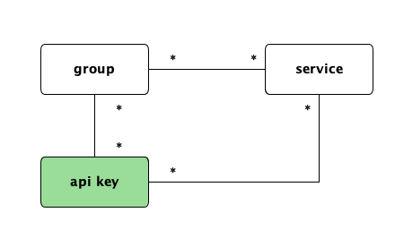
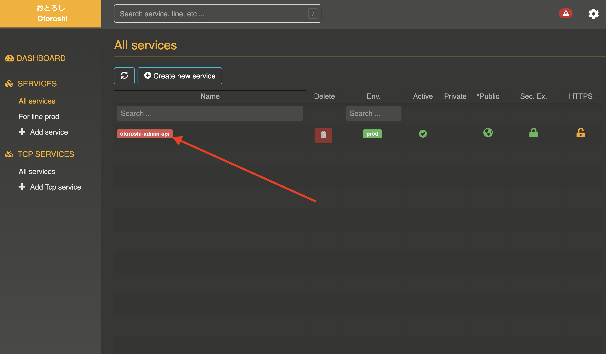

# Managing API keys

Now that you know how to create service groups and service descriptors, we will see how to create API keys.

## Otoroshi entities

There are 3 major entities at the core of Otoroshi.

* service groups
* service descriptors
* **api keys**

@@@ div { .centered-img }

@@@

An `API key` related to a `service group` to allow you to access any `service descriptor` contained in a `service group`. You can, of course, create multiple `API key` for a given `service group`.

In the Otoroshi admin dashboard, we chose to access `API keys` from `service descriptors` only, but when you access `API keys` for a `service descriptor`, you actually access `API keys` for the `service group` containing the `service descriptor`.

`API keys` can be provided to Otoroshi through :

* `Otoroshi-Authorization: Basic $base64(client_id:client_secret)` header, in that case, the `Otoroshi-Authorization` header will **not** be sent to the target. `Basic ` is optional.
* `Authorization: Basic $base64(client_id:client_secret)` header, in that case, the `Authorization` header **will** be sent to the target
* `Otoroshi-Token: Bearer $jwt_token` where the JWT token has been signed with the `API key` client secret, in that case, the `Otoroshi-Token` header will **not** be sent to the target. `Bearer ` is optional.
* `Authorization: Bearer $jwt_token` where the JWT token has been signed with the `API key` client secret, in that case, the `Authorization` header **will** be sent to the target
* `Cookie: access_token=$jwt_token;` where the JWT token has been signed with the `API key` client secret, in that case, the cookie named `access_token` **will** be sent to the target
* `Otoroshi-Client-Id` and `Otoroshi-Client-Secret` headers, in that case the `Otoroshi-Client-Id` and `Otoroshi-Client-Secret` headers will not be sent to the target.

## List API keys for a service descriptor

Go to a service descriptor using `All services` quick link in the sidebar or the search box.

@@@ div { .centered-img }

@@@

Select a `service descriptor`.

@@@ div { .centered-img }

@@@

Click on `API keys` in the sidebar

@@@ div { .centered-img }

@@@

You should see the list of API keys for that `service descriptor`

@@@ div { .centered-img }

@@@

## Create an API key for a service descriptor

@@@ div { .centered-img }

@@@

You can add a name for your new API key, you can also change client's id and client's secret. You can also configure the throttling rate of the API key (calls per second), and the authorized number of call per day and per month. You may also activate or de-activate the api key from that screen.

Informations about current quotas usage will be returned in response headers.

* `Otoroshi-Daily-Calls-Remaining` : authorized calls remaining for this day
* `Otoroshi-Monthly-Calls-Remaining` : authorized calls remaining for this month
* `Otoroshi-Proxy-Latency` : latency induced by Otoroshi
* `Otoroshi-Upstream-Latency` : latency between Otoroshi and target

@@@ div { .centered-img #quotas }

@@@

@@@ warning
Daily and monthly quotas are based on the following rules :

* daily quota is computed between 00h00:00.000 and 23h59:59.999
* monthly qutoas is computed between the first day of the month at 00h00:00.000 and the last day of the month at 23h59:59.999
@@@

## Update an API key

To update an `API key`, just click on the edit button  of your `API key`

@@@ div { .centered-img }

@@@

Update the name, secret, state and quotas (if needed) of the `API key` and click on the `Update API key` button

@@@ div { .centered-img }

@@@

## Delete an API key

To delete an `API key`, just click on the delete button  of your `API key`

@@@ div { .centered-img }

@@@

and confirm the command

@@@ div { .centered-img }

@@@

### Read only

The read only flag on an `ApiKey` this apikey can only use allowed services with `HEAD`, `OPTIONS` and `GET` http verbs.

## Use a JWT token to pass an API key

You can use a JWT token to pass an API key to Otoroshi. 
You can use `Otoroshi-Authorization: Bearer $jwt_token`, `Authorization: Bearer $jwt_token` header and `Cookie: access_token=$jwt_token;` to pass the JWT token.
You have to create a JWT token with a signing algorythm that can be `HS256` or `HS512`. Then you have to provide an `iss` claim with the value of your API key `clientId` and sign the JWT token with your API key `clientSecret`.

For example, with an API key like `clientId=abcdef` and `clientSecret=1234456789`, your JWT token should look like

```json
{
  "alg": "HS256",
  "typ": "JWT"
}
{
  "iss":"abcdef",
  "name": "John Doe",
  "admin": true
}
```

in that case, when you sign the token with the secret of the API key `1234456789`, the signature will be `_eancnYCD3makSSox2v2xErjNYkRtcX558QiJGCbino`, resulting in a encoded JWT header like

```
eyJhbGciOiJIUzI1NiIsInR5cCI6IkpXVCJ9.
eyJpc3MiOiJhYmNkZWYiLCJuYW1lIjoiSm9obiBEb2UiLCJhZG1pbiI6dHJ1ZX0.
_eancnYCD3makSSox2v2xErjNYkRtcX558QiJGCbino
```
